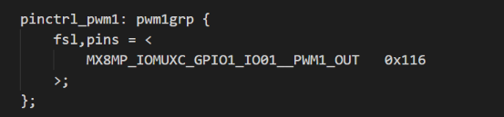
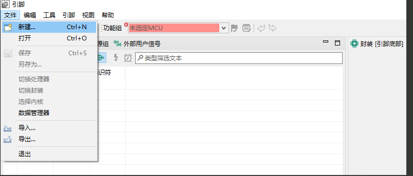
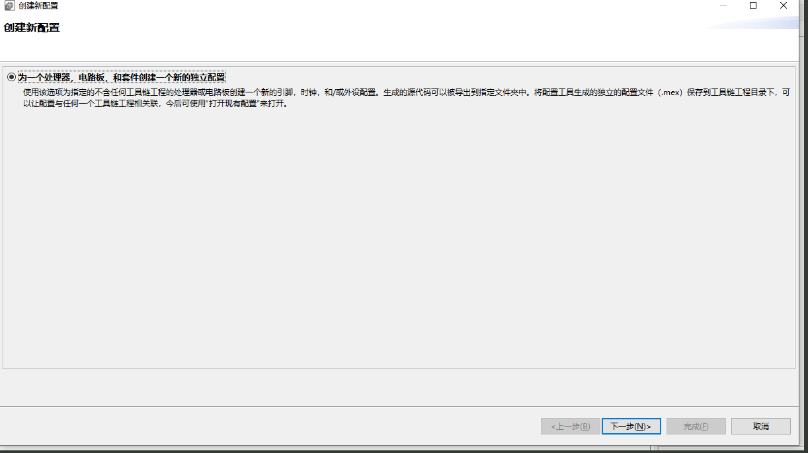
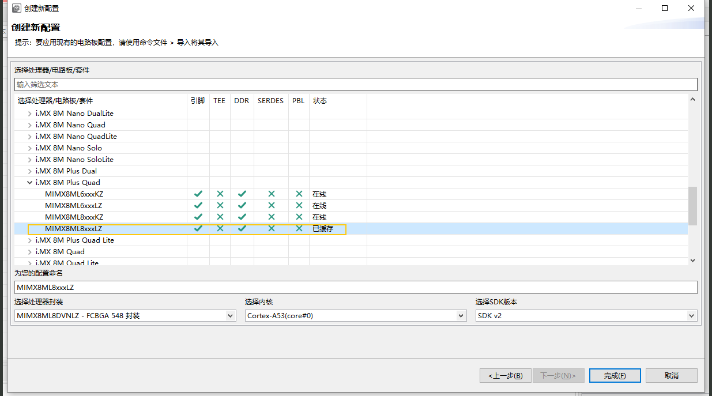
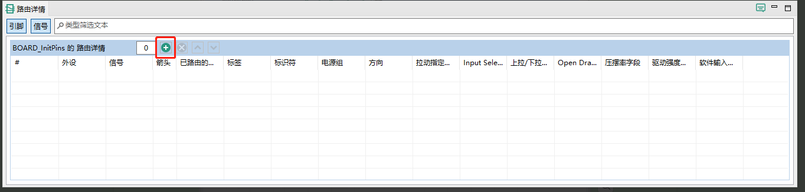
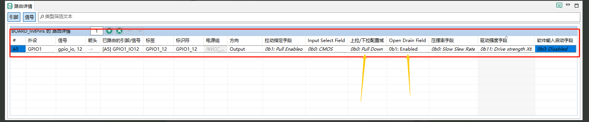
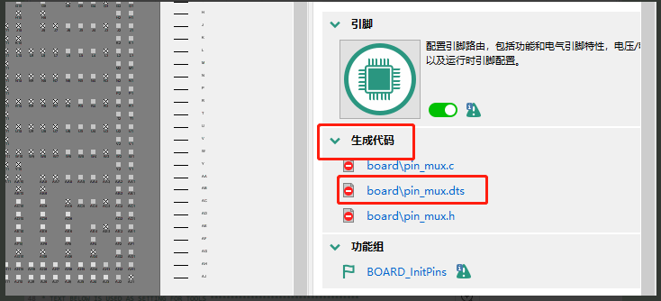
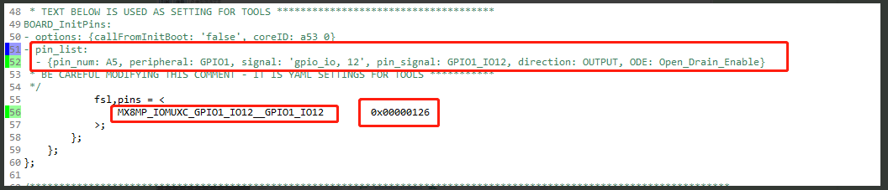

设备树引脚电气属性参数配置

下面介绍如何修改引脚电器属性参数：

📌1.设备树种对引脚的描述

在 Linux 中，**引脚配置通常在设备树（Device Tree）中完成**。这告诉内核每个引脚的用途（GPIO、I2C、UART、SPI 等）以及具体电气特性（如上拉/下拉、驱动能力等）。

`MX8MP_IOMUXC_GPIO1_IO01__PWM1_OUT`    引脚功能复用（引脚名 + 功能）

`0x116`       配置参数（驱动强度、上拉/下拉、OD 等）

DEBIX引脚的复用使用到的宏可以在`arch\arm64\boot\dts\freescale\imx8mp-pinfunc.h`里面找到。

🛠2.使用NXP官方软件配置引脚属性

DEBIX引脚的电气属性参数设置方法如下：

* a.打开官方配置工具Config Tools for i.MX v13，文件->新建
* 下载链接https://www.nxp.com/design/design-center/development-boards-and-designs/i-mx-evaluation-and-development-boards/config-tools-for-i-mx-applications-processors:CONFIG-TOOLS-IMX

* b.创建新配置，下一步

* c.选择DEBIX的处理器，完成

* d.以配置GPIO1_IO12引脚电器属性为例

这里有两个比较关键的配置是:

**🧲 Pull-up / Pull-down（上下拉）**

**🔌 Open Drain（开漏输出）**

* e. 点击右侧生成代码

可以看到引脚复用关系及电器属性描述如下

