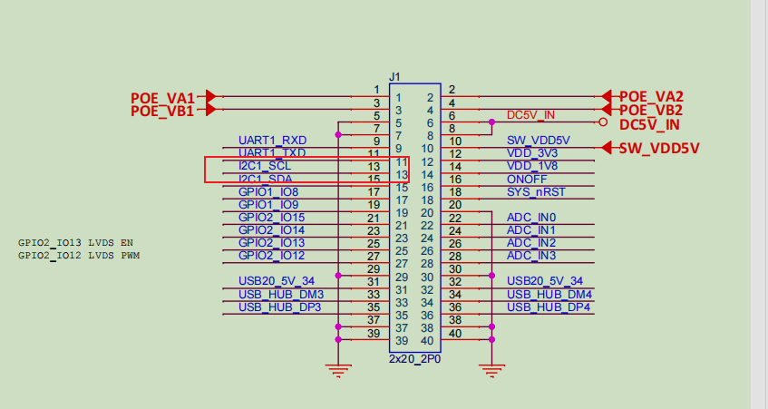

### PWM

**Output two channels of PWM on Model C:** opposite polarity, same phase, 5kHz frequency, and 50% duty cycle.

It is necessary to use different channels of the same PWM to meet the requirements; otherwise, there will be phase deviation:



1. Configure the device tree：

```
&tpm2{
	status = "okay";
	pinctrl-names = "default";
	pinctrl-0 = <&pinctrl_pwm2>;

};
&iomuxc {
pinctrl_pwm2: pwm2grp {
		fsl,pins = <
			MX93_PAD_I2C1_SCL__TPM2_CH0	0x39e
			MX93_PAD_I2C1_SDA__TPM2_CH1 0x39e
		>;
	};
};
```

Also, check if these two pins are multiplexed as I2C. If so, the relevant configuration needs to be commented out, as follows:

```
/*
	pinctrl_lpi2c1: lpi2c1grp {
		fsl,pins = <
			MX93_PAD_I2C1_SCL__LPI2C1_SCL			0x40000b9e
			MX93_PAD_I2C1_SDA__LPI2C1_SDA			0x40000b9e
		>;
	};
*/
&lpi2c1 {
	clock-frequency = <400000>;
	pinctrl-names = "default";
	// pinctrl-0 = <&pinctrl_lpi2c1>;
	status = "disabled";
	.....
	.....
};
```


2. Compile and replace the device tree:

```
./debix_build.sh
scp imx93-debix-Model_C.dtb root@192.168.2.82:/boot/imx93-11x11-evk.dtb
```

3. Configure PWM via sys:

```
echo 0 > /sys/class/pwm/pwmchip0/export
echo 200000 > /sys/class/pwm/pwmchip0/pwm0/period
echo 100000 > /sys/class/pwm/pwmchip0/pwm0/duty_cycle
echo 1 > /sys/class/pwm/pwmchip0/export
echo 200000 > /sys/class/pwm/pwmchip0/pwm1/period
echo 100000 > /sys/class/pwm/pwmchip0/pwm1/duty_cycle
echo inversed > /sys/class/pwm/pwmchip0/pwm1/polarity
echo 1 > /sys/class/pwm/pwmchip0/pwm0/enable
echo 1 > /sys/class/pwm/pwmchip0/pwm1/enable

```


