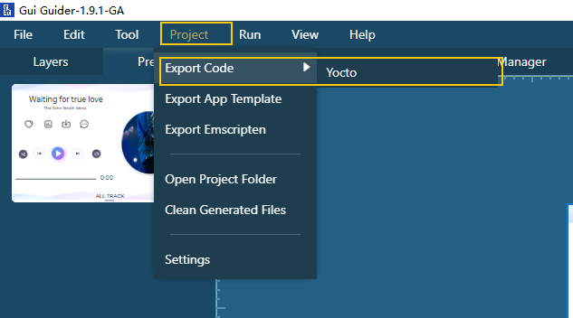
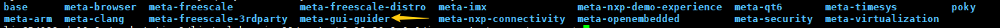
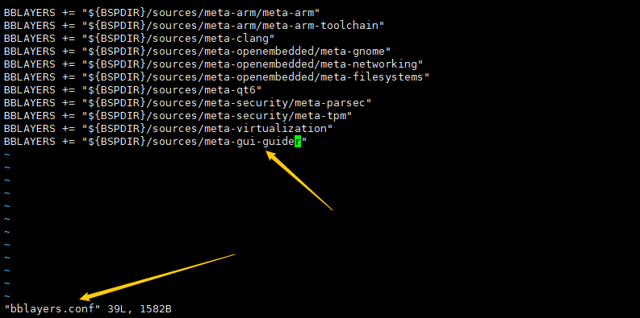
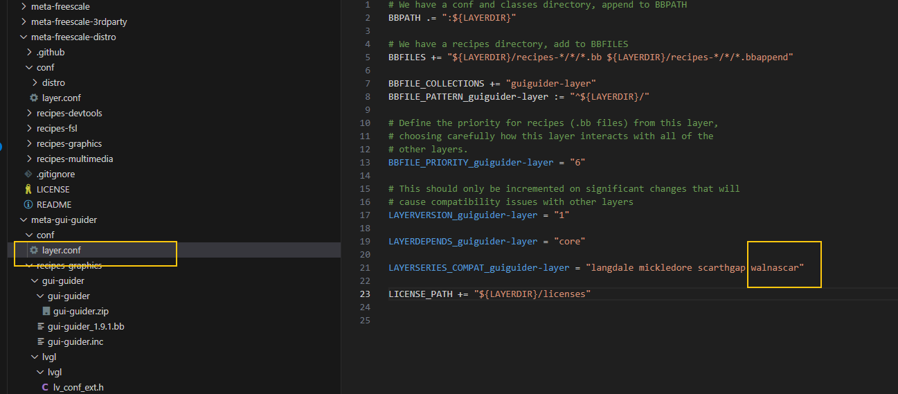
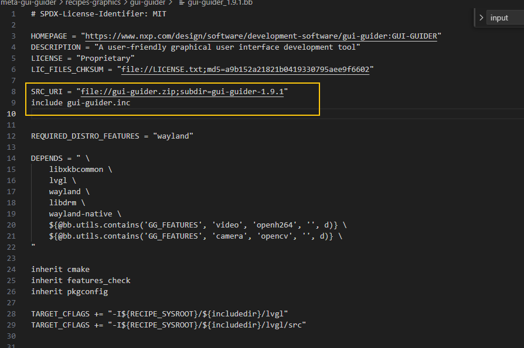
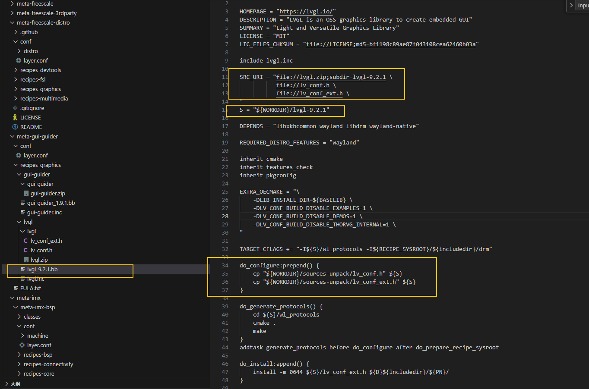

## Using LVGL on DEBIX SOM B

Below are three methods to build an LVGL demo.

#### 1. Build an LVGL Demo Using the Yocto Built-in Version

The built-in recipe can be found at `meta-openembedded\meta-oe\recipes-graphics\lvgl`

```diff

diff --git a/sources/meta-imx/meta-imx-bsp/conf/layer.conf b/sources/meta-imx/meta-imx-bsp/conf/layer.conf
index 44133532..7c8af889 100644
--- a/sources/meta-imx/meta-imx-bsp/conf/layer.conf
+++ b/sources/meta-imx/meta-imx-bsp/conf/layer.conf
@@ -492,4 +492,7 @@ IMAGE_BOOT_FILES:append:mx943-nxp-bsp = " \
 LICENSE_FLAGS_ACCEPTED += "commercial"

 IMAGE_INSTALL:append = " vim"
-IMAGE_INSTALL:append = " ffmpeg"
\ No newline at end of file
+IMAGE_INSTALL:append = " ffmpeg"
+IMAGE_INSTALL:append = " lvgl"
+TOOLCHAIN_HOST_TASK:append = " lvgl"
+IMAGE_INSTALL:append = " lvgl-demo-fb"
```


To stop Weston and use LVGL:

```shell
systemctl stop weston
lvgl &
```


#### 2. Use the GUI Guider Tool to Generate Code


##### 2.1 Generate Yocto Code for Compilation

Follow the steps below to generate the `meta-gui-guider` directory.




Place this `meta` folder under your Yocto project.



Add it to the `bblayers.conf` file.




You may also need to modify the following files:

layer.conf




gui-guider_1.9.1.bb



lvgl_9.2.1.bb




Compile: `bitbake gui-guider`

Run: `./gui_guider &`


For more details, refer to the official documentation:
https://docs.nxp.com/bundle/GUIGUIDERUG_V1-6-0/page/topics/linux.html


##### 2.2 Compile Separately

In addition to using the Yocto build system, you can also compile manually as follows:

```shell
ljm@polyhex:~/workstation/polyhex-imx93/yocto-L6.12.20-2.0.0/first-test_musicPlayer$ tree -L 1
.
├── build
├── CMakeLists.txt
├── custom
├── first-test_musicPlayer.guiguider
├── generated
├── import
├── lib
├── LICENSE.txt
├── lvgl
├── lvgl-simulator
├── ports
├── SCR.txt
└── temp


```


a. Copy the generated project to Ubuntu (skip if GUI Guider is already installed on Ubuntu).

b. Navigate to the ports/linux directory (e.g., first-test_musicPlayer/ports/linux).

Edit build.sh to set the correct toolchain path:

```c
if [ -z "$toolchain" ];then
    #toolchain=/opt/fsl-imx-xwayland/6.6-scarthgap/sysroots/x86_64-pokysdk-linux/usr/share/cmake/armv8a-poky-linux-toolchain.cmake
    toolchain=/opt/fsl-imx-xwayland/6.12-walnascar/sysroots/x86_64-pokysdk-linux/usr/share/cmake/armv8a-poky-linux-toolchain.cmake
fi
```

If you don’t have a toolchain yet, build one in the Yocto project:

```shell
bitbake imx-image-multimedia -c populate_sdk
```

Then execute in \<build-folder\>/tmp/deploy/sdk/: 

```
./fsl-imx-xwayland-glibc-x86_64-imx-image-multimedia-armv8a-imx93evk-toolchain-6.12-walnascar.sh 
```

This will install the toolchain.

c. Copy the following header files.

```shell
cp lvgl-simulator/lv_conf.h  lvgl/
cp custom/lv_conf_ext.h lvgl/
```

d. Configure `lvgl/lv_conf.h `

```c
/*Use Wayland to open a window and handle input on Linux or BSD desktops */
#define LV_USE_WAYLAND 1  //Enable this option if you want to use Wayland to handle input events.
#if LV_USE_WAYLAND
/*Draw client side window decorations only necessary on Mutter/GNOME*/
#define LV_WAYLAND_WINDOW_DECORATIONS 0
/*Use the legacy wl_shell protocol instead of the default XDG shell*/
#define LV_WAYLAND_WL_SHELL 0
#endif    /* LV_USE_WAYLAND */

/*Driver for /dev/fb*/
#define LV_USE_LINUX_FBDEV 0  //
#if LV_USE_LINUX_FBDEV
#define LV_LINUX_FBDEV_BSD 0
#define LV_LINUX_FBDEV_RENDER_MODE LV_DISPLAY_RENDER_MODE_PARTIAL
#define LV_LINUX_FBDEV_BUFFER_COUNT 0
#define LV_LINUX_FBDEV_BUFFER_SIZE 60
#endif    /* LV_USE_LINUX_FBDEV */

/*Use Nuttx to open window and handle touchscreen*/
#define LV_USE_NUTTX 0
#if LV_USE_NUTTX
#define LV_USE_NUTTX_LIBUV 0
/*Use Nuttx custom init API to open window and handle touchscreen*/
#define LV_USE_NUTTX_CUSTOM_INIT 0

/*Driver for /dev/lcd*/
#define LV_USE_NUTTX_LCD 0
#if LV_USE_NUTTX_LCD
#define LV_NUTTX_LCD_BUFFER_COUNT 0
#define LV_NUTTX_LCD_BUFFER_SIZE 60
#endif    /* LV_USE_NUTTX_LCD */

/*Driver for /dev/input*/
#define LV_USE_NUTTX_TOUCHSCREEN 0
#endif    /* LV_USE_NUTTX */

/*Driver for /dev/dri/card*/
#define LV_USE_LINUX_DRM 0  //If you need to use DRM.
#if LV_USE_LINUX_DRM
#define LV_LINUX_DRM_CARD "/dev/dri/card0"
#endif    /* LV_USE_LINUX_DRM */

/*Interface for TFT_eSPI*/
#define LV_USE_TFT_ESPI 0

/*Driver for evdev input devices*/
#define LV_USE_EVDEV 0
#if LV_USE_EVDEV
/*Deafult evdev input device*/
#define LV_EVDEV_DEVICE "/dev/input/event1"
#endif    /* LV_USE_EVDEV */


#define LV_USE_SDL 0 //Disable this to fix the following compilation error.
#if LV_USE_SDL
#define LV_SDL_INCLUDE_PATH <SDL2/SDL.h>

/workstation1/ljm/polyhex-imx93/yocto-L6.12.20-2.0.0/second-AirCon/lvgl/lv_conf.h:958:29: fatal error: SDL2/SDL.h: No such file or directory
  958 | #define LV_SDL_INCLUDE_PATH <SDL2/SDL.h>
      |                             ^

    
 //Not sure why sometimes this .h is not generated.
    /workstation1/ljm/polyhex-imx93/yocto-L6.12.20-2.0.0/second-AirCon/lvgl/src/drivers/wayland/lv_wayland.c:48:14: fatal error: wayland_xdg_shell.h: No such file or directory
   48 |     #include "wayland_xdg_shell.h"
      |              ^~~~~~~~~~~~~~~~~~~~~

```

To solve this issue, replace it with another CMakeLists.txt file.

```makefile
# SPDX-License-Identifier: MIT

cmake_minimum_required(VERSION 3.12.4)

project(gui_guider)

find_package(PkgConfig)
pkg_check_modules(PKG_WAYLAND wayland-client wayland-cursor xkbcommon)
pkg_check_modules(PKG_LIBDRM REQUIRED libdrm)

# Wayland protocols
find_program(WAYLAND_SCANNER_EXECUTABLE NAMES wayland-scanner)
pkg_check_modules(WAYLAND_PROTOCOLS REQUIRED wayland-protocols>=1.25)
pkg_get_variable(WAYLAND_PROTOCOLS_BASE wayland-protocols pkgdatadir)

# Improved macro for protocol generation.
macro(wayland_generate protocol_xml_file output_dir target)
    set(output_file_noext "${output_dir}/wayland_xdg_shell")

    # Generate the .h file.
    add_custom_command(
        OUTPUT "${output_file_noext}.h"
        COMMAND "${WAYLAND_SCANNER_EXECUTABLE}" client-header "${protocol_xml_file}" "${output_file_noext}.h"
        DEPENDS "${protocol_xml_file}"
        VERBATIM
    )

    # Generate the .c file.
    add_custom_command(
        OUTPUT "${output_file_noext}.c"
        COMMAND "${WAYLAND_SCANNER_EXECUTABLE}" private-code "${protocol_xml_file}" "${output_file_noext}.c"
        DEPENDS "${protocol_xml_file}"
        VERBATIM
    )

    # Define the generation target.
    add_custom_target(${target} DEPENDS "${output_file_noext}.h" "${output_file_noext}.c")
endmacro()

set(WAYLAND_PROTOCOLS_DIR "${CMAKE_CURRENT_SOURCE_DIR}/ports/linux/wl_protocols")
file(MAKE_DIRECTORY ${WAYLAND_PROTOCOLS_DIR})

# Protocol generation.
wayland_generate(
    "${WAYLAND_PROTOCOLS_BASE}/stable/xdg-shell/xdg-shell.xml"
    ${WAYLAND_PROTOCOLS_DIR}
    generate_protocols
)

if(NOT EXISTS ${CMAKE_SOURCE_DIR}/generated/gg_video.c)
    FILE(GLOB_RECURSE SOURCES
        ./custom/*.c
        ./custom/*.cpp
        ./generated/*.c
        ports/linux/mouse_cursor_icon.c
        ports/linux/main.c
    )
else()
    FILE(GLOB_RECURSE SOURCES
        ./custom/*.c
        ./custom/*.cpp
        ./generated/*.c
        ports/linux/mouse_cursor_icon.c
        ports/linux/main.c
        ports/linux/video/h264_dec.cpp
    )
endif()

add_executable(gui_guider ${SOURCES} ${WAYLAND_PROTOCOLS_DIR}/wayland_xdg_shell.c)

# Ensure that the protocol files are generated before compilation.
add_dependencies(gui_guider generate_protocols)

# Add the protocol directory to the include path.
target_include_directories(gui_guider PRIVATE ${WAYLAND_PROTOCOLS_DIR})

if(EXISTS ${CMAKE_SOURCE_DIR}/lvgl)
    add_subdirectory(lvgl)
    target_include_directories(lvgl PRIVATE ${WAYLAND_PROTOCOLS_DIR})
    target_include_directories(lvgl PUBLIC ${PKG_LIBDRM_INCLUDE_DIRS})
    target_include_directories(gui_guider PRIVATE lvgl/src lvgl/src/font)
endif()

target_link_libraries(gui_guider PUBLIC lvgl ${PKG_WAYLAND_LIBRARIES} ${PKG_LIBDRM_LIBRARIES} -lm)
target_include_directories(gui_guider PRIVATE
    generated
    custom
    generated/guider_customer_fonts
    generated/guider_fonts
    generated/images
)

if(EXISTS ${CMAKE_SOURCE_DIR}/generated/gg_video.c)
    target_link_libraries(gui_guider PUBLIC libopenh264.a)
    target_include_directories(gui_guider PRIVATE ports/linux/video)
endif()

if(EXISTS ${CMAKE_SOURCE_DIR}/custom/camera_support.cpp)
    pkg_check_modules(PKG_OPENCV opencv4)
    target_link_libraries(gui_guider PUBLIC ${PKG_OPENCV_LIBRARIES})
    target_include_directories(gui_guider PRIVATE ${PKG_OPENCV_INCLUDE_DIRS})
endif()

install(PROGRAMS ${CMAKE_CURRENT_BINARY_DIR}/gui_guider DESTINATION bin)

```


Then compile:

```shell
./ports/linux/build.sh
```

The executable `gui_guider` will be generated in the build directory.


Run on the development board:

```c
./gui_guider &
```


Reference:<br>
https://community.nxp.com/t5/i-MX-Processors-Knowledge-Base/Build-GUI-Guider-projects-for-iMX93-GUI-GUIDER-1-6-x-1-7-x-1-8x/ta-p/1707656


#### 3. Without Using GUI Guider

Reference: https://github.com/lvgl/lv_port_linux

This method builds and runs an LVGL demo directly using the cross toolchain.


a. Download the source code:

```
git clone https://github.com/lvgl/lv_port_linux.git
cd lv_port_linux/
git submodule update --init --recursive
```


b. Modify user_cross_compile_setup.cmake:

```makefile
# user_cross_compile_setup.cmake

# Specify the target system
set(CMAKE_SYSTEM_NAME Linux)
set(CMAKE_SYSTEM_PROCESSOR aarch64)  # ARM 64 bits

# Specify the path of the cross-compiler
set(TOOLCHAIN_DIR /opt/fsl-imx-xwayland/6.12-walnascar/sysroots/x86_64-pokysdk-linux/usr/bin/aarch64-poky-linux)
set(CMAKE_C_COMPILER   ${TOOLCHAIN_DIR}/aarch64-poky-linux-gcc)
set(CMAKE_CXX_COMPILER ${TOOLCHAIN_DIR}/aarch64-poky-linux-g++)

# Specify the target sysroot
set(CMAKE_SYSROOT /opt/fsl-imx-xwayland/6.12-walnascar/sysroots/armv8a-poky-linux)

# Make sure CMake uses the search path of the cross-compiler
set(CMAKE_FIND_ROOT_PATH ${CMAKE_SYSROOT})

# Use sysroot when looking up libraries and header files
set(CMAKE_FIND_ROOT_PATH_MODE_PROGRAM NEVER) # Use the host environment to run programs
set(CMAKE_FIND_ROOT_PATH_MODE_LIBRARY ONLY)  # Use the target environment for libraries
set(CMAKE_FIND_ROOT_PATH_MODE_INCLUDE ONLY)  # Use the target environment for header files
set(CMAKE_FIND_ROOT_PATH_MODE_PACKAGE ONLY)  # Use the target environment for packages

```

c. Build lvgl

```
cmake -DCMAKE_TOOLCHAIN_FILE=./user_cross_compile_setup.cmake -B build -S .
```

d. Build the demo

```
make  -C build -j
```


The executable will be located at:

```
build/bin/lvglsim
```

