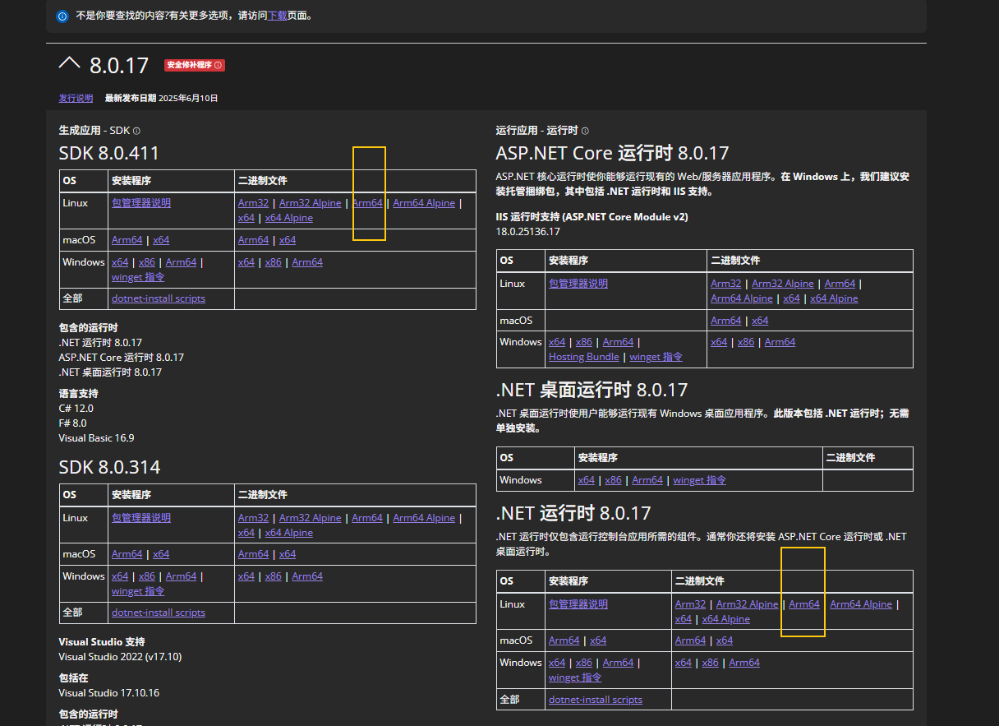

Debix运行.net应用实例


🧩 第 1 步：前往官网，下载 ARM64 版 .NET SDK 与运行时

🔗 官网地址：

👉 https://dotnet.microsoft.com/zh-cn/download/dotnet/8.0

点击：

- **.NET SDK 8.x 最新版本（arm64 / Linux）**
- 如需仅运行应用，也可下载 **.NET Runtime**




📁 第 2 步：将压缩包拷贝到 DEBIX

使用 SCP 或 U 盘方式将你下载的文件（如 `.tar.gz`）传到 DEBIX，例如：

```shell
scp dotnet-sdk-8.0.411-linux-arm64.tar.gz debix@192.168.x.x:~
```

📂 第 3 步：创建目录并解压

```
mkdir -p $HOME/dotnet
tar -xzvf dotnet-sdk-8.0.411-linux-arm64.tar.gz -C $HOME/dotnet
```

进入dotnet目录查看版本

```
root@DebixSomB:~/dotnet# ./dotnet --version
8.0.411
```

✏️ 第 4步：编写 HelloWorld 示例

创建 `HelloWorld.csproj`：

```c
root@DebixSomB:~/dotnet# vim HelloWorld.csproj
<Project Sdk="Microsoft.NET.Sdk">

  <PropertyGroup>
    <OutputType>Exe</OutputType>
    <TargetFramework>net8.0</TargetFramework>
    <ImplicitUsings>enable</ImplicitUsings>
    <Nullable>enable</Nullable>
  </PropertyGroup>

</Project>

```

创建 `Program.cs`：

```c
root@DebixSomB:~/dotnet# vim Program.cs
using System;

class Program
{
    static void Main(string[] args)
    {
        Console.WriteLine("Hello, DEBIX!");
    }
}

```

🛠️ 第 5步：编译项目

```shell
root@DebixSomB:~/dotnet# ./dotnet build

Welcome to .NET 8.0!
---------------------
SDK Version: 8.0.411

.....
......
  HelloWorld -> /root/dotnet/bin/Debug/net8.0/HelloWorld.dll

Build succeeded.
    0 Warning(s)
    0 Error(s)


```

▶️ 第 6 步：运行程序

```shell
root@DebixSomB:~/dotnet# ./dotnet run
Hello, DEBIX!

```

