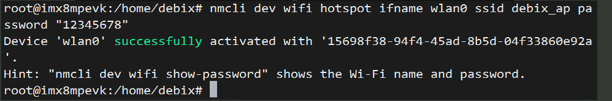
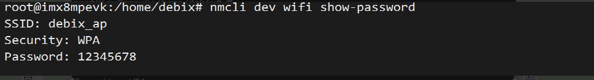
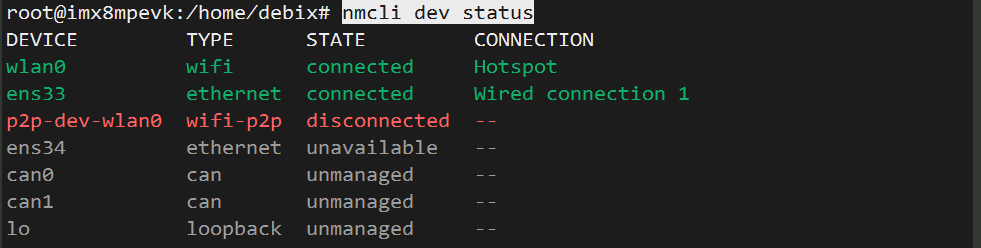
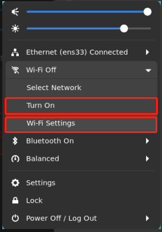
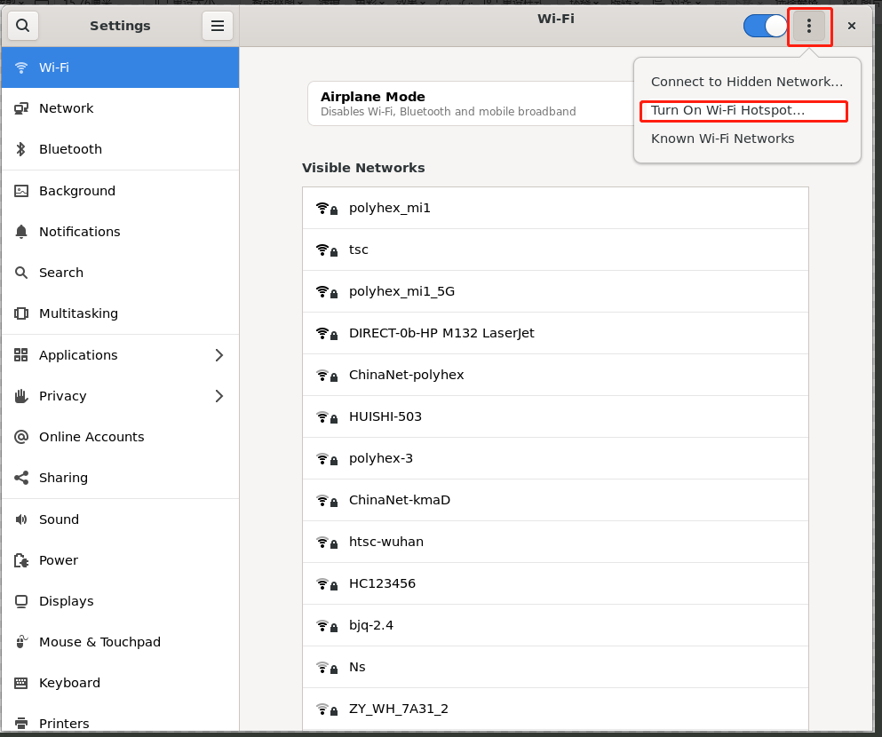
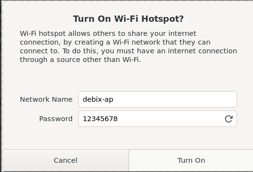

# 📶 DEBIX 设置 Wi-Fi 热点（AP 模式）


## 🧾 方式一：命令行操作（推荐用于终端环境）

🧑‍💻 1. 切换为 root 用户

```shell
sudo su
```

📡 2. 打开 Wi-Fi

```shell
nmcli radio wifi on
```

🛠️ 3. 创建 Wi-Fi 热点

```shell
nmcli dev wifi hotspot ifname wlan0 ssid debix_ap password "12345678"
```

🔍 参数说明：

| 参数                  | 含义                       |
| --------------------- | -------------------------- |
| `ifname wlan0`        | 指定热点使用的无线网卡名称 |
| `ssid debix_ap`       | 设置热点名称（Wi-Fi 名称） |
| `password "12345678"` | 设置热点密码（8~63 位）    |




✅ **执行成功后，DEBIX 将变为热点，其他设备可连接该 Wi-Fi**

🔎 4. 查看热点名称和密码

```shell
nmcli dev wifi show-password
```




📊 5. 查看网络设备状态

```shell
nmcli dev status
```



## 🖼️ 方式二：图形界面操作（适用于桌面系统）

1️⃣ 打开 Wi-Fi 设置界面

点击右上角系统托盘中的 Wi-Fi 图标，选择：

> **"Turn on"** 开启无线网络
>  然后点击 **"Wi-Fi Settings"**



2️⃣ 设置热点信息

> 1. 点击右上角「⁝」菜单（三个点）
> 2. 选择 **"Turn On Hotspot"**





3️⃣ 自定义热点名称与密码

- 输入 Wi-Fi 名称（SSID）
- 设置密码（8 位以上）

点击 **"Turn On"** 即可创建热点。

你可以在 **"Wi-Fi Settings" → "Hotspot"** 看到当前热点信息。

