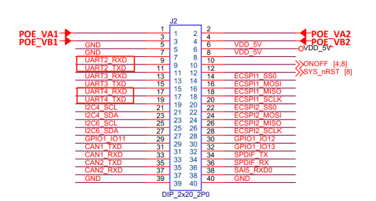
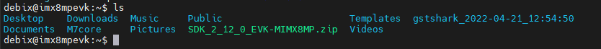
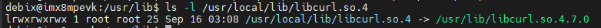
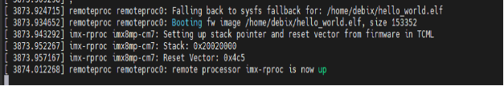

# 🚀 Debix U-Boot 启动 M7 核与 Linux 核共用指南


## 🧩 一、获取 M7 固件

📥 获取方式：

1. 🛠️ 使用 **IAR 工程** 编译；
2. 🧪 使用 **ARMCC 工具链** 编译

参考文档（NXP 官方指南）：
1.获取官方SDK https://mcuxpresso.nxp.com/en/select (下载的包名为EVK-MIMX8MP-hello_world.zip)


## 🧠二、uboot启动M7核

📝1.修改`/arch/arm64/boot/dts/freescale/imx8mp-evk.dts`设备树

在根节点下添加：

```c
reserved-memory {
        #address-cells = <2>;
        #size-cells = <2>;
        ranges;

        m4_reserved: m4@0x80000000 {
            no-map;
            reg = <0 0x80000000 0 0x1000000>;
        };
        vdev0vring0: vdev0vring0@55000000 {
            reg = <0 0x55000000 0 0x8000>;
            no-map;
        };
        vdev0vring1: vdev0vring1@55008000 {
            reg = <0 0x55008000 0 0x8000>;
            no-map;
        };
        vdevbuffer: vdevbuffer@55400000 {
            compatible = "shared-dma-pool";
            reg = <0 0x55400000 0 0x100000>;
            no-map;
        };
        rsc_table: rsc_table@550ff000 {
            reg = <0 0x550ff000 0 0x1000>;
            no-map;
        };
    };
    imx8mp-cm7 {
        compatible = "fsl,imx8mp-cm7";
        rsc-da = <0x55000000>;
        clocks = <&clk IMX8MP_CLK_M7_DIV>;
        mbox-names = "tx", "rx", "rxdb";
        mboxes = <&mu 0 1
              &mu 1 1
              &mu 3 1>;
        memory-region = <&vdevbuffer>, <&vdev0vring0>, <&vdev0vring1>, <&rsc_table>;
        status = "okay";
    };  
```


 ⏰2.修改设备时钟`clk-imx8mp.c`

```c
--- /drivers/clk/imx/clk-imx8mp.c
+++ /drivers/clk/imx/clk-imx8mp.c
@@ -728,6 +728,9 @@
 
 	check_m4_enabled();
 
+	if (of_find_compatible_node(NULL, NULL, "fsl,imx8mp-cm7"))
+		set_cm4_enable(true);
+
 	np = of_find_compatible_node(NULL, NULL, "fsl,imx8mp-anatop");
 	anatop_base = of_iomap(np, 0);
 	of_node_put(np);
```

⚙️3.修改M7核设备驱动


```c
--- /drivers/remoteproc/imx_rproc.c
+++ /drivers/remoteproc/imx_rproc.c
@@ -25,6 +25,11 @@
 
 #include "remoteproc_internal.h"
 
+//add by wei
+#define TCML_ADDR_IMX8M		0x7e0000
+#define TCML_ADDR_IMX8_CM4_1		0x34fe0000
+#define TCML_ADDR_IMX8_CM4_2		0x38fe0000
+
 #define IMX7D_SRC_SCR			0x0C
 #define IMX7D_ENABLE_M4			BIT(3)
 #define IMX7D_SW_M4P_RST		BIT(2)
@@ -131,10 +136,37 @@
 	int				num_domains;
 	struct device			**pm_devices;
 	struct device_link		**pm_devices_link;
+	//add by wei
+	u32				m_core_ddr_addr;
+	u32 				last_load_addr;
+	u32				m4_start_addr;
 };
 
 static struct imx_sc_ipc *ipc_handle;
 
+// add by wei
+static const struct imx_rproc_att imx_rproc_att_imx8mp[] = {
+	/* dev addr , sys addr  , size	    , flags */
+	/* ITCM   */
+	{0x00000000, 0x007E0000, 0x00020000, ATT_OWN},
+	/* OCRAM_S */
+	{0x00180000, 0x00180000, 0x00009000, 0},
+	/* OCRAM */
+	{0x00900000, 0x00900000, 0x00090000, 0},
+	/* QSPI Code - alias */
+	{0x08000000, 0x08000000, 0x08000000, 0},
+	/* DDR (Code) - alias */
+	{0x10000000, 0x40000000, 0x0FFE0000, 0},
+	/* DTCM */
+	{0x20000000, 0x00800000, 0x00020000, ATT_OWN},
+	/* OCRAM_S - alias */
+	{0x20180000, 0x00180000, 0x00008000, ATT_OWN},
+	/* OCRAM */
+	{0x20200000, 0x00900000, 0x00090000, ATT_OWN},
```


```c
--- /drivers/remoteproc/remoteproc_core.c
+++ /drivers/remoteproc/remoteproc_core.c
@@ -1114,6 +1114,14 @@
 	if (!rproc->table_ptr)
 		return 0;
 
+	//add by wei
+
+	if ((int)rproc->table_ptr->num < 0) {
+		WARN_ON(rproc->table_ptr->num);
+		rproc->table_ptr->num=0;
+		return 0;
+	}
+
 	for (i = 0; i < rproc->table_ptr->num; i++) {
 		int offset = rproc->table_ptr->offset[i];
 		struct fw_rsc_hdr *hdr = (void *)rproc->table_ptr + offset;
@@ -1373,7 +1381,7 @@
 	 * that any subsequent changes will be applied to the loaded version.
 	 */
 	loaded_table = rproc_find_loaded_rsc_table(rproc, fw);
-	if (loaded_table) {
+	if (loaded_table && rproc->cached_table) {
 		memcpy(loaded_table, rproc->cached_table, rproc->table_sz);
 		rproc->table_ptr = loaded_table;
 	}
```


```c
--- /drivers/remoteproc/remoteproc_elf_loader.c
+++ /drivers/remoteproc/remoteproc_elf_loader.c
@@ -133,16 +133,16 @@
 {
 	if (!rproc->ops->elf_memcpy)
 		memcpy(dest, src, count);
-
-	rproc->ops->elf_memcpy(rproc, dest, src, count);
+	else
+		rproc->ops->elf_memcpy(rproc, dest, src, count);
 }
 
 static void rproc_elf_memset(struct rproc *rproc, void *s, int c, size_t count)
 {
 	if (!rproc->ops->elf_memset)
 		memset(s, c, count);
-
-	rproc->ops->elf_memset(rproc, s, c, count);
+	else
+		rproc->ops->elf_memset(rproc, s, c, count);
 }
```


4.文件拷贝
将`hello_world.bin`文件拷贝至SD卡，同镜像和设备树在同一分区。

5.硬件连接
连接UART2和UART4至PC，波特率为115200，如图：




6.启动M7核
进入到uboot命令行，执行如下命令：

```shell
fatload mmc 1:1 0x48000000 hello_world.bin;cp.b 0x48000000 0x7e0000 20000;  
bootaux 0x7e0000  
```

此时应该可以看到UART4S在串口终端打印出hello world.说明M7核可以正常工作。
在执行bootcmd命令，如果可以正常进入到系统，则A53核和M7可以同时工作。


7.uboot快捷启动
进入到uboot命令行界面，输入如下命令：

```shell
setenv m7_image hello_world.bin
setenv m7_loadaddr 0x7e0000
setenv m7_copyaddr 0x96000000
setenv m7_loadimage "fatload mmc '${mmcdev}':'${mmcpart}' '${m7_copyaddr}' '${m7_image}'; cp.b '${m7_copyaddr}' '${m7_loadaddr}' 0x20000"
setenv run_m7_image "run m7_loadimage; dcache flush; bootaux '${m7_loadaddr}'" 
```

上述设置可以在进入uboot后，执行`run run_m7_image`命令即可直接启动M7内核。


## 🧑‍💻三、在debix内开发M7核固件


1.获取SDK源码
https://mcuxpresso.nxp.com/en/download?hash=502a027cddc304d8e16cc44319a90811&uvid=455793&dl=1&js=1&to_vault=true

2.下载SDK资源包，将SDK包拷贝到Debix板目录中：



3.创建文件夹M7_SDK，并将SDK包解压到M7_SDK中：

```shell
mkdir M7_SDK
unzip SDK_2_12_0_EVK-MIMX8MP.zip -d M7_SD
```


4.安装cmake
①安装cmake：

```shell
sudo apt install cmake 
```

②更换动态链接库，否则后面cmake编译会提示找不到libcurl.so.4：

```shell
sudo rm /usr/lib/libcurl.so.4
sudo ln -s /usr/lib/libcurl.so.4.7.0 /usr/local/lib/libcurl.so.4
```

使用`ls -l /usr/local/lib/libcurl.so.4`查看动态链接库是否安装成功：



5.获取gcc-arm-none-eabi交叉工具链
进入M7_SDK/目录，获取工具链并配置环境变量：

```shell
wget https://armkeil.blob.core.windows.net/developer/Files/downloads/gnu-rm/9-2019q4/gcc-arm-none-eabi-9-2019-q4-major-aarch64-linux.tar.bz2

tar -xvf gcc-arm-none-eabi-9-2019-q4-major-aarch64-linux.tar.bz2
```


编辑 `.bashrc`文件，配置环境变量，在最后一行添加如下内容：

```shell
sudo vi ~/.bashrc
export ARMGCC_DIR=~/M7_SDK/gcc-arm-none-eabi-9-2019-q4-major
source ~/.bashrc
```

6.编译固件
进入hello_world工程的armcc目录：

```shell
cd ~/M7_SDK/boards/evkmimx8mp/demo_apps/hello_world/armgcc/
```

运行build_all.sh脚本，将会在当前目录下生成这些文件夹，一般使用release版本的即可：

```shell
./build_all.sh
```


7.使用固件
在M7_SDK目录下创建root目录，然后将SD卡的分区1挂载至此目录，将上一步编译完成的hello_world.bin文件拷贝至该目录：

```shell
cd ~/M7_SDK
mkdir root && cd root
sudo cp -f ../boards/evkmimx8mp/demo_apps/hello_world/armgcc/release/hello_world.bin ./
```

复位Debix，在uboot中执行`run run_m7_image`命令，即可加载运行M7核的新固件。


## 🔧四、在debix内烧录M7核固件并启动


1.准备固件
生成的release文件夹下将会有一个`hello_world.elf`的固件。

2.查看M7核状态
进入root用户，修改内核log打印等级：

```shell
sysctl kernel.printk=7;
```

查看M7核状态：

```shell
cat /sys/class/remoteproc/remoteproc0/state
```

如果在uboot中启动了M7核，此时需要先关闭M7核：

```shell
echo stop > /sys/class/remoteproc/remoteproc0/state
```

3.烧录固件

```shell
echo  /home/debix/M7_SDK/boards/evkmimx8mp/demo_apps/hello_world/armgcc/release/hello_world.elf > /sys/class/remoteproc/remoteproc0/firmware
```

4.启动M7核

```shell
echo start > /sys/class/remoteproc/remoteproc0/state
```

📟查看串口，串口打印如下说明M7核正常启动，此时串口4将会输出打印信息：



