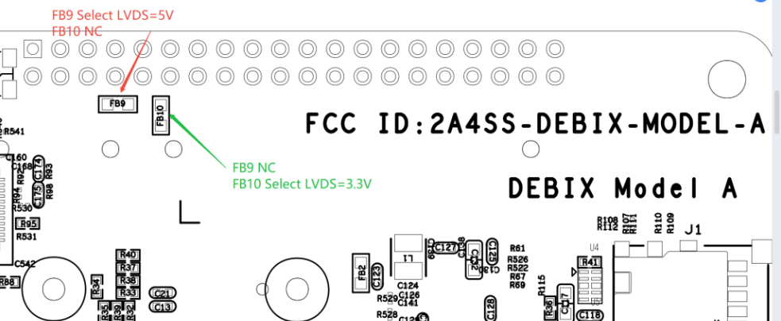
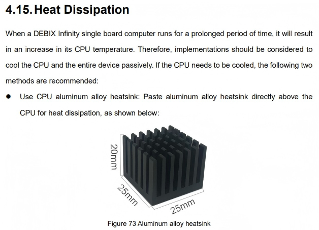
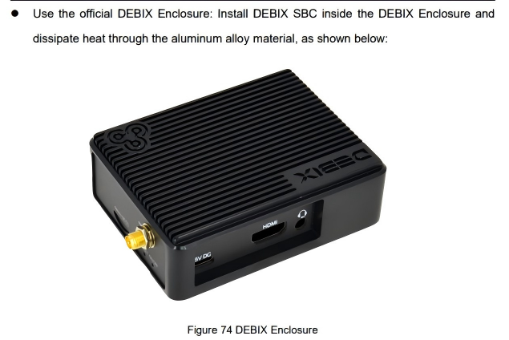
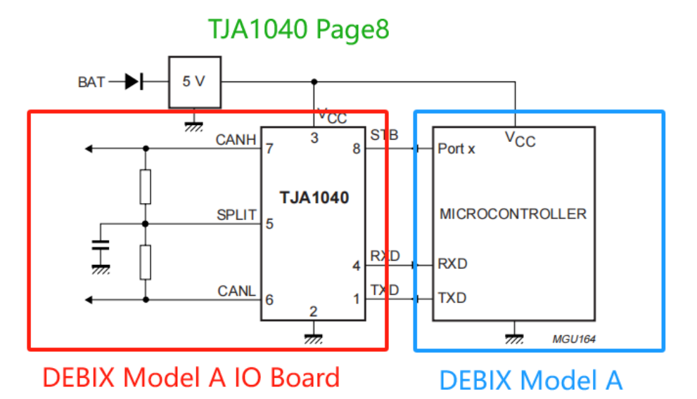
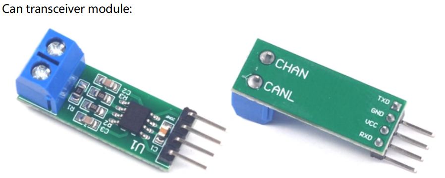
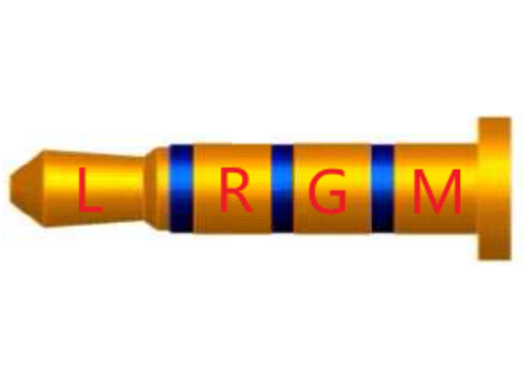

## DEBIX FAQ - Hardware Questions

**1. ls it possible to connect two or more DEBlX together to make a faster computer?**  
Yes,but you can't  make a powerful compluter by simply bolting it togeher to play games at a faster speed. You can network omputers to build a a cluster computer system, but you need to modify the software to work in this distributed manner.

**2. Where is the power switch?** 
The On/Off and reset buttons are located next to the power supply interface. DEBIX supports Automatic Power On. When you need to shut down the device, if you are using DEBIX Desktop, just click the power button in the upper right corner of the desktop, and then select Shutdown. If you are not using the desktop, you can enter sudo poweroff at the console to shutdown. After the LEDs are off, you should wait one second to ensure that the SD card can complete its wear leveling tasks and write operations. And then you can safely unplug DEBIX. Failure to close DEBIX properly may damage your SD card, which means you must re-mirror it.

**3. Does it support adding additional memory?**  
No, it doesn't. The RAM on DEBIX is a separate chip on the motherboard and cannot be upgraded after purchase.


**4. Why is the clock speed of my DEBIX running slower than advertised?**  
The clock speed is lower than the advertised speed in idle time. As the workload of the CPU increases, the clock speed will increase until it reaches the maximum value (the specific situation varies by CPU model). If the CPU starts to overheat, the situation is more complex: When the device reaches a certain temperature, the clock speed is throttled to prevent overheating.

**5. Does it support overclocking?**  
Yes, it supports. But overclocking will void your warranty. Due to the way silicon chips are produced, each device supports a different degree of overclocking. For a capable and stable system, we recommend that you do not overclock your DEBIX.

**6. Does the HDMI port support CEC?**  
Yes, it does.
 
**7. Does DEBIX support VGA?**  
DEBIX displays support various video signals including but not limited to VGA and HDMI inputs, but DEBIX computers do not have built-in VGA ports. To use VGA:
- Use an active HDMI-to-VGA adapter (passive cables will not work).
- Ensure the adapter has external power (unpowered adapters will not function properly).

**8. Does it support adding a touch panel?**  
Yes, it does.

**9. Does it support sound transmission via HDMI?**  
Yes.

**10. How about standard audio input and output?**  
There is a standard 3.5mm interface for audio output (speaker). You can add any supported USB microphone, or you can use the I2S interface to add a codec for additional audio I/O.


**11. Can I power the motherboard through a USB hub?**  
It depends on the USB hub. Some hubs comply with the USB 2.0 standard and only provide 500mA per port, which is not enough to power your DEBIX.

**12. Can I use the battery or wall socket to power DEBIX?**  
Running DEBIX directly on the battery requires more attention, and it may damage your DEBIX. However, if you are a practised user, you can give it a try. For example, the four most common AA rechargeable batteries can provide 4.8V when fully charged. Technically 4.8V is just within the tolerance of DEBIX, but as the battery runs out, the system quickly becomes unstable. While four AA alkaline (non-rechargeable) batteries can provide 6V voltage, which exceeds the acceptable tolerance range and may damage your DEBIX. By using a buck and/or boost circuit, you can ensure stable 5V voltage (or using a charger set specifically designed to output a stable 5V from several batteries). These devices are usually sold as emergency battery chargers for mobile phones.
 
**13. Is Power Over Ethernet (POE) feasible?**  
Yes, but it need to be equipped with a POE power supply module.

**14. What size SD card is needed?**  
Micro SD card.

**15. What capacity of SD card does it support?**  
Although the minimum capacity of 8GB should be enough for most people, we have tried SD cards up to 128GB and they all work well. You can also connect a USB flash disk or mobile hard disk to provide additional storage capacity.

**16. Can I boot DEBIX through a USB-connected hard disk instead of an SD card?**  
No, it doesn’t support.

**17. Does it has built-in wireless network?**  
DEBIX has built-in 2.4G & 5G WiFi.

**18. Does it has built-in bluetooth?**  
There’s a built-in bluetooth 5.0.

**19. What models of cameras are supported?**  
OV5640, etc.

**20. How about the resolution?**  
DEBIX supports maximum resolution of 4kp60 and it has superb codecs (h.265, h.264, VP9...).

**21. Does DEBIX only support one display when I play video in full screen?**  
The DEBIX Model A/B/Infinity supports triple-screen or dual-screen display via HDMI/LVDS/MIPI interfaces, defaulting to extended mode.

**22. What is the touch rotation angle of the touch screen?**  
90 degrees.

**23. Does it support networking？**  
Yes, it supports. DEBIX has 1000BaseT wired Ethernet and one network interface (pin headers) without network compiler.

**24. How do I connect a mouse and keyboard?**  
Please refer to DEBIX manual document on [official website](https://www.debix.io/).

**25. Is there a GPU binary?**  
Yes

**26. Can I add a touchscreen?**  
Yes
 
**27. Is sound over HDMI supported?**  
Yes

**28. What about standard audio in and out？**  
3.5mm audio interface

**29. How to use DEBIX Model A for 5V CAN communication?**  
It needs to be used in conjunction with a CAN transceiver peripheral for CAN communication, such as DEBIX I/O Board, or other CAN transceiver modules.

**30. Can DEBIX control a cooling fan programmatically, similar to the Raspberry Pi?**  
Yes, it can. The GPIO pins on DEBIX can output a 3.3V control signal. You can connect the fan's control wire to a compatible GPIO pin and use the provided `debix-gpio` to set the pin's output level, thereby turning the fan on or off.

**31. Besides the Power USB Type-C port, are there alternative ways to power the DEBIX Model A?**  
Yes, the board can also be powered through the 5V pins (Pin 6 and Pin 8) on the GPIO header.

**32. Is there any recorded data on the CPU temperature of DEBIX Model A running Ubuntu/Win10 when idle on the desktop, both with and without a heatsink?**  
- Model A 4GB DDR | Ubuntu 20.04 (idle on desktop):
  - Without heatsink: 47°C
  - With heatsink: 42°C  
>*Measurement method: CPU internal temperature read via command `cat /sys/class/thermal/thermal_zone0/temp`*  

- Model A 8GB DDR | Windows 10 IoT (idle on desktop):
  - Without heatsink: 53°C (measured via external probe on CPU surface)
  - With heatsink: 47°C (measured via external probe on CPU surface)  
>*Note: As Windows 10 does not support direct CPU temperature reading via command, measurements were taken using a temperature probe contacting the CPU surface. The actual internal CPU temperature is estimated to be approximately 20°C higher than the surface reading, with noticeable heat to the touch.*

**33. Is resistor modification required to use an IPEX connector for BT & WiFi on the DEBIX Infinity?**  
No, resistor modification is not required on the Infinity board.

*Note: This is different from the DEBIX Model A/B, where using the IPEX connector does require resistor rework. For details, please refer to the documentation in our official blog, linked here: https://debix.io/blog/wifi-external-antenna-connections-sop-on-debix-model-a/*

**34. How many USB3 controllers are available for the four USB3 ports of the DEBIX Model A/B?**  
One controller.

**35. LVDS power supply voltage selection for DEBIX Model A.**   
The LVDS on DEBIX Model A defaults to 5V power supply, with no 12V option. For 3.3V, customers need to manually select the jumper resistor.     
(The DEBIX Model A/B/C series are powered by Type-C 5V and do not have a 12V option.) 
<p align="left">

</p>

**36. Can pin6 (VDD_5V) of the DEBIX Model A GPIO interface be used to power the DEBIX single-board computer? Is it only for power supply?**  
The 5V Pin6 can be used to power both the DEBIX Model A/B and the peripheral devices of DEBIX Model A/B.

**37. Are the add-on board stackable?**  
Some are stackable on the DEBIX Model A. Such as [DEBIX 4G Board](https://debix.io/product/debix-4g-board/) and [DEBIX SBC PoE Module](https://debix.io/product/debix-sbc-poe-module/).

**38. Is there any way to connect to both of the two MIPI CSI-2 ports on the NXP i.MX8MPlus on the DEBIX Model A SBC?**  
DEBIX Model A SBC only has one MIPI CSI interface. The second one interface was not routed to the PCB due to space limitations. If you require two MIPI CSI ports, we recommend using [DEBIX SOM A](https://debix.io/product/debix-som-a/) together with [DEBIX SOM A IO Board](https://debix.io/product/debix-som-a-i-o-board/).

**39. Is there any maximum SD card size for the DEBIX Model A.**   
Technically it supports up to 2TB. DEBIX has tested up to 256GB. For capacity above 256GB, you may need to varify compatibility on your side. 

**40. Are there any cooling options available on the DEBIX Infinity?**   
Yes, you can use an aluminum CPU heatsink or the DEBIX enclosure for cooling. Both methods are mentioned in Section 4.15 “Heat Dissipation” of [the DEBIX Infinity User Manual](https://github.com/debix-tech/debix-infinity/tree/master/Reference_Manuals) *(Or refer to the following images)*. In addition, the DEBIX Infinity enclosure is also available from RS.
<p align="center">
 

</p>

**41. What part number of the Model A/B SoC is used exactly?**    
CPU part number: MIMX8ML8CVNKZAB

**42. What is the voltage range for the USB Type-C input? Can it handle voltages above 5V, such as 9V or 12V? The schematic appears to have some type of regulator, taking TYPEC5V_IN and generating USB30_5V. What type of regulator is U34?**  
The USB Type-C connector is designed for 5V input only and must not be used with 9V or 12V adapters. U34 is a current-limiting switch (load switch).

**43. How can I obtain a female cable to connect the 2x20(40-pin) header on the DEBIX Infinity to another board?**   
> DEBIX Infinity 40pin header: 2*20Pin/2.0mm pitch.  

You can select and purchase suitable cables according to the connector specifications. (2.0mm pitch Dupont wire) 

**44. Are the three 4G modules mentioned in the user manual the only ones compatible with the DEBIX 4G board? Is the Quectel EC25EFA-512-SKT module compatible since it has the same form factor? Because it is the same form factor.**    
The three models listed in the manual are the 4G modules that have been tested and confirmed to be supported by the 4G expansion board. The Quectel EC25EFA-512-SKT module should in theory be compatible, as it shares the same form factor and interface specifications.

**45. The GPIO voltage of the DEBIX board is 3.3 V. Will using a 5 V CAN protocol damage the circuit? How can it be implemented?**   
No, it will not cause damage.    
The CAN interface on the DEBIX board includes only the CAN controller, and an external CAN transceiver is required to interface with a 5 V CAN bus. You can use the official [DEBIX Model A I/O Board](https://debix.io/product/debix-i-o-board/), which integrates a TJA1040 CAN transceiver, and simply connect to the CAN_H and CAN_L pins on the I/O board.   
Alternatively, you may use any compatible external CAN transceiver module.
<p align="center">
 

</p>

**46. How to connect four USB cameras to BPC-iMX8MP-05**    
You can enable four cameras to operate simultaneously with the following configuration:  
1. Connect the camera with the highest bandwidth requirement (such as a 4K camera) to a dedicated OTG interface (e.g., Bus 01) to avoid bandwidth contention. 
2. Connect the remaining three cameras (such as 2K or 1080p cameras) to the same bus (e.g., Bus 03) and set their input format to MJPEG.
3. Use the following commands to repeatedly test and adjust the camera parameters to achieve the best display performance with all four cameras:  
*(You can also adjust the frame rate using the `-framerate` option.)*
```
sudo apt install ffmpeg
ffplay -f v4l2 -input_format mjpeg -video_size 1920x1080 -i /dev/video?
```

**47. After connecting the device to the ETH-2 Ethernet port, the device suddenly powers off. Only the red LED remains on, and the system cannot boot normally. What could be the possible cause?**     
This issue is usually related to Power over Ethernet (PoE) or the use of a non-standard Ethernet cable.   
Please follow the steps below to troubleshoot:  
1. Check the Ethernet cable type:
Ensure that a standard Ethernet cable (e.g., a straight-through cable) is used. Avoid homemade cables or cables with non-standard pin assignments.
2. Verify the peer device:
Check whether the other end of the Ethernet cable is connected to a regular switch or a PoE-enabled switch. If it is connected to a PoE switch, the PoE voltage may be injected through the Ethernet cable, which can cause a short circuit or trigger protective power shutdown of the device.

> Recommendation:
> Before connecting the Ethernet port, always confirm that the peer device is a non-PoE switch and that a standard Ethernet cable is used to prevent similar issues.

**48. Why is the electret microphone not recognized on DEBIX Model A? Do I need to use an amplifier?**    
No, an amplifier is not required. The onboard 3.5mm audio jack on DEBIX Model A/B is designed as a headset (headphone + microphone) port. For microphone functionality, it only supports 4-pole (TRRS) headset plugs. The board natively supports electret microphones.
the typical microphone pinout used for PC audio differs from the 4-pole headset standard. To use your electret mic, you must connect it according to the DEBIX pinout as follows:
- **Tip:** Left Audio Channel
- **Ring 1:** Right Audio Channel
- **Ring 2:** Ground (GND) — Connect the microphone's ground wire here.
- **Sleeve:** Microphone (MIC) — Connect the microphone's signal wire here.
<p align="left">
 
</p>

**49. What is the simplest way to use two 1920x1080 HDMI displays with DEBIX Model A?**   
The DEBIX Model A has only one HDMI port, so achieving a dual 1920x1080 HDMI setup requires external hardware. The simplest method depends on your specific needs:  
1. For Two Mirrored Displays (Same Content):
Solution: This is the simplest method for identical output. Purchase an `external HDMI Splitter` (1-in, 2-out). Connect the board's single HDMI output to the splitter, and then connect both monitors to the splitter's outputs.
2. For Two Independent Displays (Extended Desktop):
Solution: Connect one display directly to the board's HDMI port. For the second display, you need to purchase an additional screen with a different interface supported by the board's expansion connectors, such as `LVDS or MIPI`, and connect it normally.
>Recommended for Dedicated Projects:
If your project permanently requires dual HDMI outputs, the most integrated and reliable solution is to order a custom board designed with two native HDMI output interfaces.


<div align="right">  

[▲ Return to the Top](#debix-faq---hardware-questions)
</div>