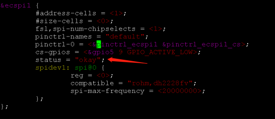
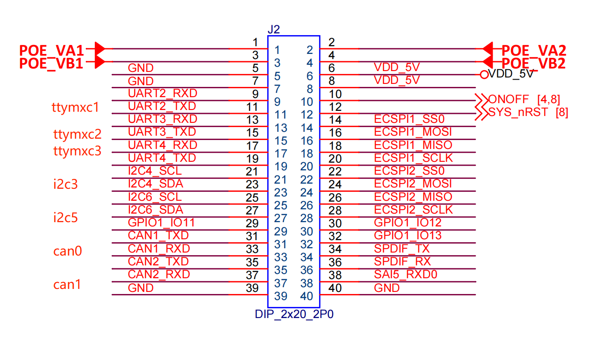
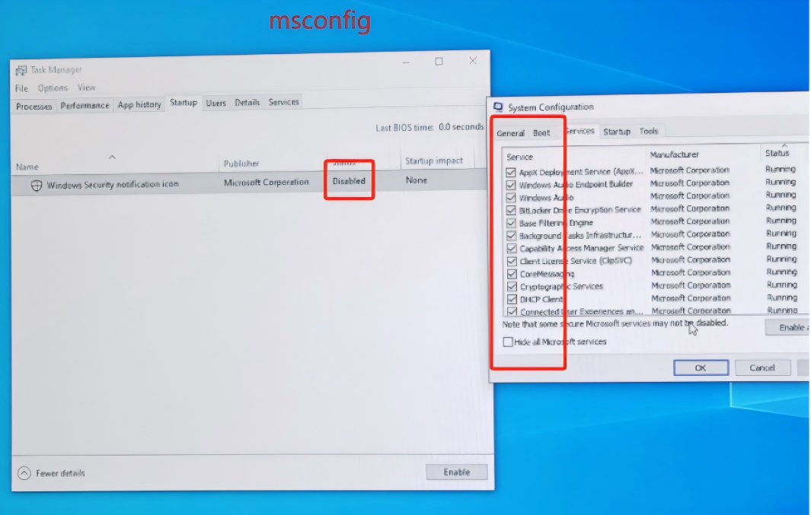
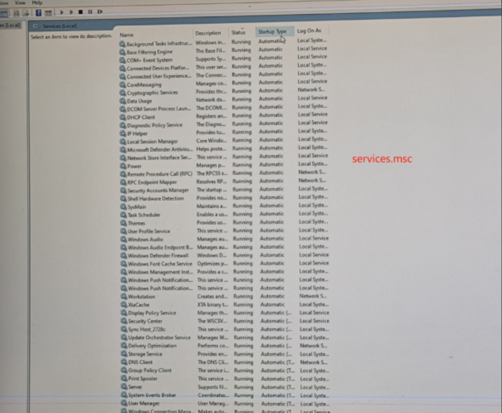
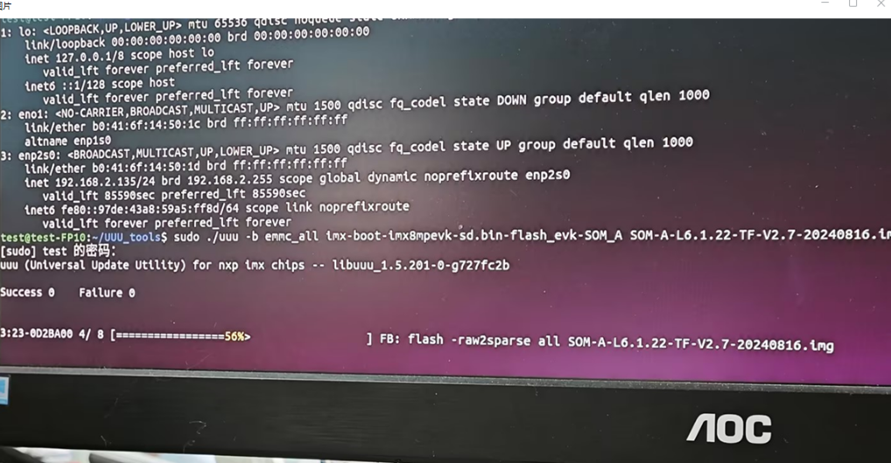
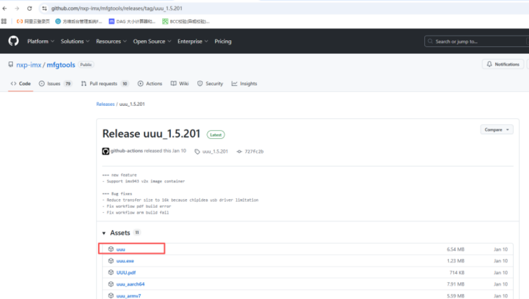
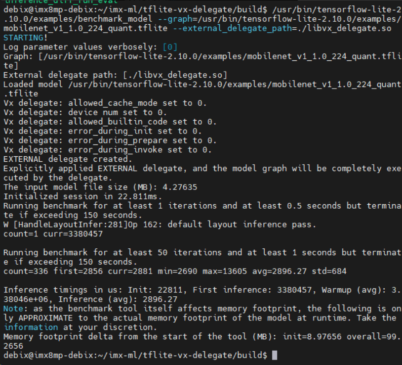
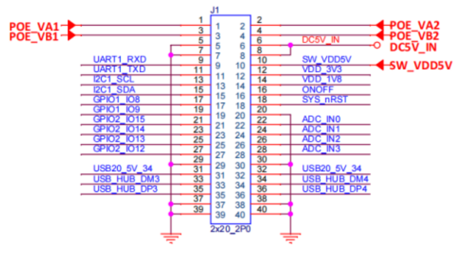
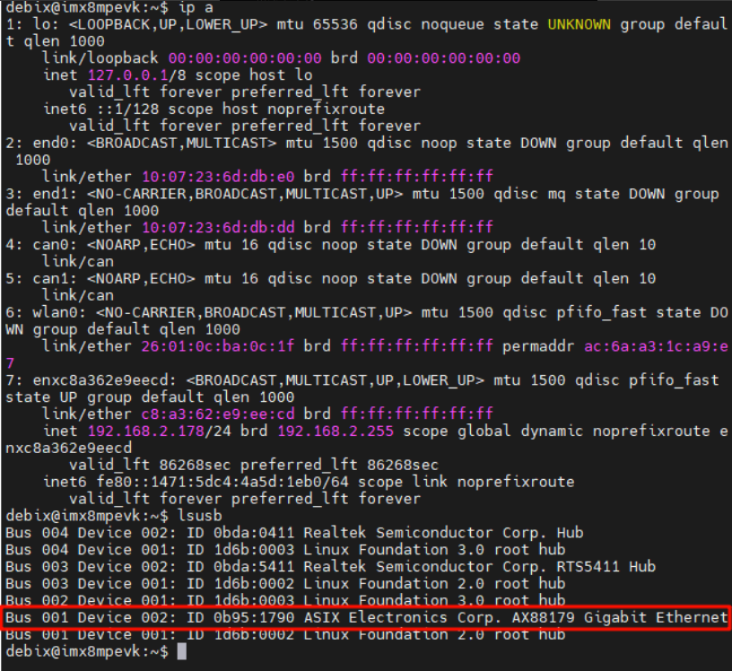

## DEBIX FAQ - Software Questions

**1. What should I do if the flashing fails?**  
You can restore it through re-programming the SD card.

**2. What operating system does it support?**  
Our products support various operating systems, including Ubuntu,Android, Yocto, Debian and Windows

**3. Can PC or Mac software be run on DEBIX?**  
No, DEBIX only supports ARM64 linux software.

**4. Will it run old software?**  
In general, you need to see if it supports programming for Armv6, Armv7, or Armv8 architectures on Linux. In most cases, the answer is yes. There is nothing more direct than using DEBIX and testing it to find out the answer!

**5. How to share documents from DEBIX with windows computers?**  
You can share files with windows computers via samba or ftp.

**6. How to run the program at startup?**  
After Linux is loaded, it will initialize the hardware and device drivers, and then run the first process `init`. `Init` continues the boot process according to the configuration file and starts other processes. Usually, the modification is placed in script files in the following directory:   
     `/etc/rc` or   
     `/etc/rc.d` or   
     `/etc/rc?.d`  
You can make `init` start other programs automatically, such as editing `/etc/rc.d/rc.local` file (this file is usually the last script started by the system), adding a line "xinit" or "startx" at the end of the file and entering X-Window directly after booting up.


**7. How to run the program at a specific time?**  
Linux has a daemon called crond, whose main function is to periodically check the contents of a set of command files in the /var/spool/cron directory and execute the commands in these files at a set time. Users can create, modify, and delete these command files through the crontab command.  
For example, create a file crondFile with the content "00 9 23 Jan * HappyBirthday". After running the "crontab cronFile" command, the system will automatically execute the "Happy Birthday" program at 9:00 am on January 23 ("*" means no matter what day is the day of the week).

**8. Why there’s no response when I am entering the password?**  
- If it is a graphical interface, you can check the status of your input method;
- If it is a text interface, the password is not displayed when entering the password. After you enter the correct password, just press the enter key.

**9. Why is there no real-time clock?**  
Due to insufficient space there's no real-time clock. There are two sets of I2C pin headers reserved, and an RTC clock module can be connected by yourself.

**10. How to modify the software source of the Ubuntu system?**  
(1) Back up the original file (optional step);  
    `sudo cp /etc/apt/sources.list /etc/apt/sources.list.bak`  
(2) Open the `/ect/apt/sources.list` file, comment out or delete the existing software source, and then add the software source you need;  
(3) Update: `sudo apt-get update`.

**11. After inserting the USB device, I enter lsusb in the terminal and couldn't find any information about this device.**  
(1) Test the USB interface. For example, after you connect a USB mouse, execute lsusb to check if there is a mouse connected.  
(2) The peripherals cannot be identified. It is recommended to check whether other devices can be identified normally.

**12. How to modify the sleep mode?**  
In `Settings`-`Power`, there are "`press the key to sleep`" and "`scheduled sleep`" for options.

**13. How to configure the wireless network card when using a system without a desktop?**  
(1) Turn on the power of the wireless network card:  
`iwconfig wlan0 txpower on`  
The signal light of the wireless network should be on.  
(2) List wireless networks in the area:  
`iwlist wlan0 scan`  
(3) Assuming you want to connect to the network MyHome MyHome (essid is MyHom), then enter the command:  
`iwconfig wlan0 essid "MyHome"`  
If the network is encrypted and the password is 0123456789, then enter the command:  
`iwconfig wlan0 essid "MyHome" key 0123-4567-89`  
 
**14. Use FileZilla in Windows 10 but fail to connect DEBIX.**  
- Please check whether the IP address is the same with the IP address on the board.  
- Please check whether the IP address on window 10 has the same network segment with the IP address on DEBIX.


**15. How to configure the sound card?**  
Use `root` to log in and then run `/usr/sbin/sndconfig`, and you will see the interface for selecting sound card types. Generally you can select Sound Blaster. After selection you need to set relevant resources, in this process you can use `TAB key` and `direction keys` to make selections and then press `OK`. If you hear the voice of Linus (the founder of Linux), it means that the sound card is set up successfully.

**16. How to run jar file?**  
(1) Install JDK  
`sudo apt-get update`  
`sudo apt-get install openjdk-8-jdk`  
(2) Run the file  
`java -jar file name.jar`

**17. How to change the language into Chinese？**  
Setting Interface: `settings` - `Region & Language` - `Manage Installed Languages` - select `Chinese` - click `Restart`

**18. How to synchronize network time?**  
Adjust the time zone to the local area, once connected to the internet, the time will be updated synchronously.

**19. How to use PuTTY to log in to DEBIX?**  
(1) Open PuTTY and enter the IP address of DEBIX to log in;  
(2) When you first log in you need to confirm the connection key, please press "`Yes`" to confirm. This prompt only appears when logging in for the first time;  
(3) After logging in, you will be prompted to enter the user name and password, and then you can log in to the DEBIX command line.  
*(Note: the default DEBIX user name/password is `debix`/`debix`)*

**20. How to enable SSH service?**  
(1) Find the sshd service configuration file `sshd_config` in the `/etc/ssh/` directory and open it with the Vim editor; Remove the "`#`" before the monitor port and monitor address in the file; then enable the remote login; Finally, enable the use of user name and password as connection verification; Save the file and exit;  
(2) If the connection fails, please enter `ps -e | grep sshd` to check whether the sshd service is enabled;  
(3) In order to avoid manual start of sshd service every time at startup, you can add the sshd service to the self-starting list and enter `systemctl enable sshd.service`;  
(4) You can enter `systemctl list-unit-files | grep sshd` to see if the sshd service is set to start automatically.

**21. How to modify the keyboard layout?**  
Modify the attribute value of `XKBLAYOUT` in `/etc/default/keyboard`, the current value is `us`, and it can be changed to `cn`, and then call the `setupcon` command to take effect directly
 
**22. How to set the resolution of DEBIX VNC?**  
`vncserver - geometry resolution`

**23. How to configure DEBIX’s WiFi and SSH without display device and keyboard?**  
Read the SD card which has finished flashing with a computer. Create a new `wpa_supplicant.conf` file in the `boot` partition (DEBIX's `/boot` directory), fill in the content according to the following reference format and save the `wpa_supplicant.conf` file.  
|   |   |
|---|---|
1|country=CN
2|ctrl_interface=DIR=/var/run/wpa_supplicant GROUP=netdev
3|update_config=1
4|
5|network={
6|ssid="WiFi-A"
7|psk="12345678"
8|key_mgmt=WPA-PSK
9|priority=1
10|}
11|
12|network={
13|ssid="WiFi-B"
14|psk="12345678"
15|key_mgmt=WPA-PSK
16|priority=2
17|scan_ssid=1
18|}

Instructions and configuration examples of WiFi with different security:  
```
#ssid: ssid of the network  
#psk: password  
#priority: Connection priority, a larger number means higher priority (a negative number is unacceptable)  
#scan_ssid: You need to specify the value to 1 when connecting to hidden WiFi  
```
<br>

If your WiFi has no password:  
|   |   |
|---|---|
1|network={
2|ssid="name of your wireless network（ssid）"
3|key_mgmt=NONE
4|}

<br>

If your WiFi uses WEP encryption:
|   |   |
|---|---|
1|network={
2|ssid="name of your wireless network（ssid）"
3|key_mgmt=NONE
4|wep_key0="your wifi password"
5|}

<br>
 
If your WiFi uses WPA/WPA2 encryption:
|   |   |
|---|---|
1|network={
2|ssid="name of your wireless network（ssid）"
3|key_mgmt=WPA-PSK
4|psk="your wifi password"
5|}
 
If you are not sure about the WiFi encryption mode, you can open `/data/misc/wifi/wpa/wpa_supplicant.conf` through root explorer on your Android phone to view the WiFi information.

If the Access denied prompt appears when connecting to DEBIX via ssh, it means that the ssh service is not enabled. If you want to enable it manually, you can create a new file (a blank file is acceptable) in the boot partition like WiFi configuration and name it ssh (use lowercase and do not have any extensions).

**24. Log in to DEBIX without a display device and unknown IP?**  
Use the network segment scanning tool, the software will automatically detect the network segment where the computer is located, and automatically determine the scanning range. (For example, the computer IP is 192.168.1.101, and the scanning range is 192.168.1.*), find the device whose manufacturer is "DEBIX".  
If you have the login authority of the router (such as home network), you can also directly query the IP address assigned to DEBIX by the router on the management interface of the router.
 
**25. When a HDMI monitor and 3.5mm earphone or speaker are connected at the same time, how to specify one of them as the audio output device?**  
Open `settings` - `audio`
 
**26. What are the steps to install and configure vsftpd on DEBIX?**  
(1) Install vsftpd:    
`sudo apt-get install vsftpd`   
(2) Restart the vsftpd service:  
`service vsftpd restart`  
(3) Access DEBIX via FTP on the PC side:  
Enter in the address bar: ftp:\\192.168.1.x  
Enter user name and password as prompted

**27. How to use systemd to set boot startups under Linux?**  
Create a `*.service file` (* is the service name, such as myscript.service)  
Use root user and save this file to the `/etc/systemd/system` directory:  
`sudo cp myscript.service /etc/systemd/system/myscript.service`  
Then you can try to start the service with the following command:  
`sudo systemctl start myscript.service`  
Stop the service:  
`sudo systemctl stop myscript.service`  
Set automatic run at boot:  
`sudo systemctl enable myscript.service`  
The systemctl command can also be used to restart or disable it.

**28. How to take a screenshot on DEBIX?**  
`PrtSc`: Take a screenshot of the entire screen and save it to the Pictures directory.  
`Shift + PrtSc`: Take a screenshot of a certain area of the screen and save it to the Pictures directory.  
`Alt + PrtSc`: Take a screenshot of the current window and save it to the Pictures directory.  
`Ctrl + PrtSc`: Take a screenshot of the entire screen and save it to the clipboard.  
`Shift + Ctrl + PrtSc`: Take a screenshot of a certain area of the screen and save it to the clipboard.  
`Ctrl + Alt + PrtSc`: Take a screenshot of the current window and save it to the clipboard.  
*The screenshot will be automatically saved in the Pictures folder*  

**29. What’s the mounting method of fstab and mobile hard disk?**  
DEBIX supports automatic mounting of USB storage devices, and it can also be mounted by modifying `/etc/fstab`;

**30. Does it support automatic mounting of external USB storage devices?**  
Yes.

**31. How to modify the startup animation of DEBIX?**  
If you want to modify the startup animation, please provide the bmp picture for us to add to the kernel image.

**32. How to modify the hostname of DEBIX?**  
Run `hostnamectl` to view the hostname of the current system;  
Use the following command to change the hostname:  
`hostnamectl set-hostname [YOUR NEW HOSTNAME]`

**33. What is the username and password for Debix?**  
Username：`debix`  
Password：`debix`

**34. How to configure the wireless network card when using a system without a desktop?**  
(1) Plug in the Ethernet cable to get DEBIX connected to the internet, run command `sudo apt install isc-dhcp-client` to get `dhclient` command;  
(2) Run command `sudo ifconfig wlan0 up`;    
(3) Create file `/etc/wpa_supplicant/wpa_supplicant.conf` with the following contents:  
```
network={  
ssid="polyhex_mi1"  
psk="bohai2021"  
}  
```
Substitute the ssid and psk with your wifi name and wifi password;  
(4) Run command `sudo wpa_supplicant -i wlan0 -c /etc/wpa_supplicant/wpa_supplicant.conf -B`  
(If error "Device or resource busy" is thrown, try command "`sudo killall wpa_supplicant`");  
(5) Run command `sudo dhclient wlan0`  
Then you can check whether DEBIX can connect to the internet through ping command.

**35. How to run jar file?**  
(1) Install JDK;  
`sudo apt update`  
`sudo apt install default-jdk -y`  
(2) Run the file  
`java -jar file name.jar`

**36. How to set the resolution of DEBIX VNC?**  
`sudo apt install tightvncserver`  
`vncserver -geometry resolution`

**37. How to flash the DEBIX OS to make a bootable Micro SD card?**  
Please refer to the DEBIX User Manual documentation on [website](https://www.debix.io). 

**38. How to use DEBIX desktop?**  
Please refer to Chapter 4 of [the DEBIX Model A User Guide](https://debix.io/hardware/model-a.html).

**39. How to configure network from desktop on DEBIX?**  
Please refer to DEBIX Model A documentation chapter3 System Configuration in the [DEBIX Documentation](https://www.debix.io/Document/manual_info/id/4.html#a1).

**40. How to configure network from command line on DEBIX?**  
Please refer to DEBIX MODEL A documentation chapter3 System Configuration in the [DEBIX Documentation](https://www.debix.io/Document/manual_info/id/4.html#a1).

**41. How to rotate your display on DEBIX?**  
You can rotate your display from the desktop on Debix. Open Settings then Displays and then set the Orientation to your desired value.

**42. How to mount a storage device on DEBIX?**  
Please refer to Section 3.5.1 of Chapter 3 System Configuration in the [DEBIX documentation](https://www.debix.io/Document/manual_info/id/4.html#a1).

**43. How to setup automatic mounting on DEBIX?**  
Please refer to Section 3.5.2 of Chapter 3 System Configuration in the [DEBIX documentation](https://www.debix.io/Document/manual_info/id/4.html#a1).

**44. How to unmount a storage device?**  
Please refer to Section 3.5.3 of Chapter 3 System Configuration in the [DEBIX documentation](https://www.debix.io/Document/manual_info/id/4.html#a1).

**45. How to change the language on DEBIX?**  
If you want to select a different language, configure in `Settings` from the desktop. “`Settings`” ---> “`Region& Language`”.

**46. How to change the timezone on DEBIX?**  
For changing the timezone, you can change it in `Settings` from the desktop.

**47. How to install a firewall on DEBIX?**  
Run command `sudo apt install ufw`. For more details, you can refer to Section 3.7.3 of Chapter 3 System Configuration in the [DEBIX documentation](https://www.debix.io/Document/manual_info/id/4.html#a1).

**48. How to install fail2ban on DEBIX?**  
Run command `sudo apt install fail2ban`. For more details, you can refer to Section 3.7.4 of Chapter 3 System Configuration in the [DEBIX documentation](https://www.debix.io/Document/manual_info/id/4.html#a1).

**49. How to configure screen blanking on console of DEBIX?**  
Please refer to Section 3.8.1 of Chapter 3 System Configuration in the [DEBIX documentation](https://www.debix.io/Document/manual_info/id/4.html#a1).

**50. How to configure screen blanking on the desktop of DEBIX?**  
Please refer to Section 3.8.2 of Chapter 3 System Configuration in the [DEBIX documentation](https://www.debix.io/Document/manual_info/id/4.html#a1).

**51. How to build kernel for DEBIX?**  
Please refer to Section 4.2 of Chapter 4 Linux Kernel Introduction in the [DEBIX documentation](https://www.debix.io/Document/manual_info/id/4.html#a1).

**52. How to configure kernel for DEBIX?**  
Please refer to Section 4.3 of Chapter 4 Linux Kernel Introduction in the [DEBIX documentation](https://www.debix.io/Document/manual_info/id/4.html#a1).

**53. How to find your IP address?**  
Run command `hostname -I`. For more details,  you can refer to Section 6.1.1 of Chapter 6 Remote Access in the [DEBIX documentation](https://www.debix.io/Document/manual_info/id/4.html#a1).

**54. How to set secure shell from windows10?**  
Please refer to Section 6.4 of Chapter 6 Remote Access in the [DEBIX documentation](https://www.debix.io/Document/manual_info/id/4.html#a1).

**55. How to set passwordless SSH access?**  
Please refer to Section 6.5 of Chapter 6 Remote Access in the [DEBIX documentation](https://www.debix.io/Document/manual_info/id/4.html#a1).

**56. How to use secure copy(scp)?**
Please refer to Section 6.6 of Chapter 6 Remote Access in the [DEBIX documentation](https://www.debix.io/Document/manual_info/id/4.html#a1).

**57. How to use rsync?**  
Please refer to Section 6.7 of Chapter 6 Remote Access in the [DEBIX documentation](https://www.debix.io/Document/manual_info/id/4.html#a1).

**58. How to configure NFS(Network File system) on DEBIX?**  
Please refer to Section 6.8 of Chapter 6 Remote Access in the [DEBIX documentation](https://www.debix.io/Document/manual_info/id/4.html#a1).

**59. What is samba?**  
Samba is an implementation of the SMB/CIFS networking protocol that is used by Microsoft Windows devices to provide shared access to files, printers, and serial ports.  
You can use Samba to mount a folder shared from a Windows machine so it appears on your Debix, or to share a folder from your Debix so it can be accessed by your Windows machine.
For more details, you can refer to Section 6.9 of Chapter 6 Remote Access in the [DEBIX documentation](https://www.debix.io/Document/manual_info/id/4.html#a1).

**60. How to set up an apache server?**  
Please refer to Section 6.10 of Chapter 6 Remote Access in the [DEBIX documentation](https://www.debix.io/Document/manual_info/id/4.html#a1).

**61. How to set static IP address on DEBIX when using WIFI?**  
Click the cog icon on the right of the corresponding network name (on the premise that you have connected to that wireless network) in “`Wi-Fi`” of “`Settings`”.

**62. Are DEBIX Ubuntu OS all LTS versions?**  
Yes.

**63. What protocol is DEBIX Ubuntu using?**  
Wayland.

**64. From which version of DEBIX Ubuntu is fully DDR compatible?**  
DEBIX Ubuntu22.04 (L6.1.22, v3.5).

**65. When testing PTP time synchronization with EQOS on DEBIX Model A, I can see event outputs in Pinmux, but cannot find documentation about their connections to specific pin headers or test points. Is there any information on this?**   
You can find more information on the official DEBIX blog, linked here: https://debix.io/blog/tsn-synchronization-time/.

**66. Can you confirm there is no issue to use Python and pyGTK on Debix OS?**  
Please refer to this official DEBIX blog: https://debix.io/blog/use-of-pygtk-on-debix/

**67. On the Debix Ubuntu 2G version, the rfkill utility is blocking Bluetooth. What can be done to resolve this?**  
You can try stopping the NetworkManager service, as it can sometimes conflict with Bluetooth. Use the command: `sudo systemctl stop NetworkManager`. If this resolves the issue and you wish to make the change permanent, you can disable the service from starting on boot with: `sudo systemctl disable NetworkManager`.

**68. Is there any eample on how to configure the IOMUXes of the i.MX8MP processor? I'm trying to use pin20 of J2 as a GPIO5_IO6 which is its ALT5 function, but it is not working.**  
Pin 20 is designated for SPI function. To use it as a GPIO, you must first disable the SPI functionality by setting the "status" property to "disabled" in the device tree configuration, as shown in the reference diagram. After this change, the pin can be reconfigured as GPIO5_IO6. 
<p align="left">

</p>

For detailed instructions, please refer to the official blog:
https://debix.io/blog/debix-model-a-gpio-instruction-manual/

**69. After downloading the Ubuntu image file following the installation guide on YouTube, the video showed a "Copy File Hash" option, but this option is not available in the image file I downloaded.**   
The hash value is used to verify the integrity of the downloaded image file. You can install a hash value viewing tool *(e.g., Hash Tab_v6.0.0.34_Setup.exe)* on your Windows system to view the value.

**70. How to enter the UBoot mode on SOM A IO?**  
Connect the debug cable, and during startup, quickly and continuously press the "Enter key" to enter Uboot.

**71. On DEBIX Model A running Ubuntu 22.04, I set a static IP using the NetworkManager (nmtui) tool. However, after rebooting DEBIX, another IP address appears alongside my configured static IP, both on the same Ethernet device (ens33). This new IP remains the same every time it appears. How can I remove this additional IP and retain only my configured static IP?**   
Temporarily disable NetworkManager during system startup and re-enable it after boot completes.  
Method to disable the service:  
`systemctl stop NetworkManager`  
`systemctl disable NetworkManager`  
Method to enable the service:  
`systemctl start NetworkManager`

**72. How can I get clone of eMMC and flash to another?**  
Please refer to the steps below:
```
Clone eMMC and make a Micro SD card to flash the eMMC system installation package:

Environment preparation: 1 x SD card reader, computer or virtual machine with Linux system, 2 x Micro SD card of at least 16GB size;

(Note: Please make sure you fully understand all the contents of this document before proceeding, proceeding blindly may result in data loss.)

1. Enter DEBIX official website (https://debix.io/download-system-image/), download the system image (Boot from SD Card).
2. Then you can use the tool called Etcher to write the system image to the Micro SD card. For the detailed flash method, please refer to the burning tutorial in the corresponding motherboard user manual.
3. Insert the Micro SD card into the motherboard, and power on, the system will boot from the Micro SD card.
4. Enter the system desktop, and switch to the administrator user via `sudo su` command.
5. Create a folder to mount the eMMC file system and boot partition.
mkdir -p /mnt/fat32
mkdir -p /mnt/ext4
6. Mount the partition of eMMC.
mount /dev/mmcblk2p1 /mnt/fat32/
mount /dev/mmcblk2p2 /mnt/ext4/
7. Enter the ext4 directory and pack the file system.
cd /mnt/ext4
tar -cjpf ../imx-image-desktop-imx8mpevk.tar.bz2 ./*
8. Enter the fat32 directory and pack the boot partition.
cd /mnt/fat32
tar -cpf ../boot.tar ./*
9. Now the Micro SD card contains the file system and boot backed up from eMMC.
10. Transfer over the network or insert the Micro SD card into a computer with a Linux environment to copy the backup files to the computer.

(Note: If no Linux environment, you can operate the Micro SD card by booting the motherboard from eMMC.)

11. Prepare another Micro SD card, write the downloaded system image (Boot from eMMC) to the Micro SD card.
12. After booting, insert the Micro SD card into PC with Linux or the motherboard with eMMC and mount the Micro SD card.
mount /dev/sda2 /mnt/ext4 

(Note: Pay attention to change the SD card's disk character display in Linux system.)

13. Unzip the backup boot partition.
mkdir boot 
tar -xpf boot.tar -C boot/

(Note: When copying, there may be an error indicating insufficient space. Please expand the ext4 partition on the Micro SD card appropriately in advance.)

14. Copy the file system, the extracted device tree and kernel files to the corresponding directory in the Micro SD card.
cp -ar boot /mnt/ext4/upgrade/
cp imx-image-desktop-imx8mpevk.tar.bz2 /mnt/ext4/upgrade/
15. Generate md5 value of the file system.
cd /mnt/ext4/upgrade
md5sum imx-image-desktop-imx8mpevk.tar.bz2 > rootfs.md5
16. Pull out the Micro SD card and insert it to the motherboard, it will burn the new system into eMMC.

```

**73. When using DEBIX SOM A with a GSM module, I connect to ttyUSB1 via minicom but see no GPS data. What might be the issue?**  
The GSM module may not have its GPS function enabled. For example, with a Quectel GSM module, you can enable GPS by sending the command AT+QGPS=1 to ttyUSB2.

**74. Does DEBIX support suspend/resume on Android or Ubuntu?**  
Yes, DEBIX supports suspend/resume on Android or Ubuntu by default, and you can set the delay time with "Automatic Suspend" in the Power function of DEBIX desktop Setting app.

**75. Can the DEBIX Infinity with 4GB RAM use the Windows 10 IOT image?**  
The DEBIX Infinity with 4GB RAM supports the Windows 10 IOT image. However, we recommend the 8GB RAM configuration because the 4GB Infinity may experience slight lag when running the Windows system. For the DEBIX Model A/B, an 8GB RAM configuration is currently required.  
Additionally, for the Windows 10 IOT image for Infinity, it needs to be provided separately by Polyhex (please contact our staff to assist you). The Windows image available on the official website is only for use with Model A/B.

**76. What are the u-boot and kernel’s branches and versions for Debix Model A SBC using Yocto LF5.10.72-2.2.x and Yocto LF5.15.71-2.2.x?**   
For Debix Model A Yocto LF5.10.72-2.2.x, the u-boot branch is lf_v2021.04 and the kernel branch is debix.   
For Yocto LF5.15.71-2.2.x, the u-boot branch is lf_v2022.04 and the kernel branch is Model_AB-L5.15.71.

**77. I'm using the DEBIX Model B, but I can't find a device tree file specifically for Model B.**  
DEBIX Model A and DEBIX Model B use the same configuration. Please use `imx8mp-evk.dts`.

**78. Is I2C3 actually I2C4?**   
Yes. The hardware labels I2C1, I2C2, I2C3, I2C4, I2C5, and I2C6, but in software each index needs to be reduced by 1.
So they correspond to I2C0, I2C1, I2C2, I2C3, I2C4, and I2C5. The same applies to UART: the hardware numbering starts from 1, while the software numbering starts from 0. Please refer to the diagram below.
<p align="left">

</p>

**79. How can I reduce the boot time of DEBIX?**   
You can try disabling unnecessary startup applications and services, and also turn off certain system services such as Windows Update and Windows Search. In our tests, the boot time to the desktop can be reduced to around 50 seconds.
<p align="left">


</p>

**80. Can I flash the eMMC image to the SOM module using a Linux system?**     
Yes. You can use the UUU tool under Linux to flash the image to the eMMC, as shown in the figure below (this method is only for flashing Linux systems).
If you need to flash a Windows system, please strictly follow the operation guide or instruction video.
The Linux version of the UUU tool can be downloaded from: 
https://github.com/nxp-imx/mfgtools
<p align=left>


</p>

**81. Using NPU Delegate on DEBIX Model A/B.**   
Our official DEBIX system comes pre-integrated with the `libvx_delegate` library.
Although we were able to compile the VeriSilicon `tflite-vx-delegate` on our platform (kernel lf6.1.22), it resulted in runtime errors. Switching to the NXP-provided `tflite-vx-delegate-imx` resolved these issues.  

References:
- VeriSilicon delegate: https://github.com/VeriSilicon/tflite-vx-delegate
- NXP delegate: https://github.com/nxp-imx/tflite-vx-delegate-imx
<p align=left>

</p>

**82. How can I compile the kernel on the Debix Model B and get a MediaTek MT7610U WiFi adapter working?**  
Follow the steps below. The key is enabling the driver for your specific chipset and installing the necessary firmware.  
1. Install the required compilation tools:
```
sudo apt install git bc bison flex libssl-dev make libc6-dev libncurses5-de
```
2. Get the kernel source code and navigate to its directory:
```
git clone -b lf_6.1.22-debix_model_a\&b\&infinity --single-branch https://github.com/debix-tech/linux-nxp-debix.git
cd linux-nxp-debix
```
3. Configure the kernel with the MT76x0U driver:
```
echo "CONFIG_MT76x0U=y" >> arch/arm64/configs/imx_v8_defconfig
```
4. Compile and install the kernel:
```
make imx_v8_defconfig
make -j4
sudo make INSTALL_MOD_STRIP=1 modules_install
sudo cp arch/arm64/boot/Image /boot/Image
```
5. Install the required firmware:   

The MT7610U chip requires a specific firmware file. Install it using:
```
sudo apt install linux-firmware
```
This will place the necessary mt7610u.bin file in `/usr/lib/firmware/mediatek/`.  

6. Reboot and verify:
- Reboot your device with `sudo reboot`.
- After rebooting, use commands like iw dev or ifconfig to check for the presence of your wireless interface (e.g., wlan0), confirming that the driver and firmware are loaded correctly.

**83. The DEBIX SOM A IO board is equipped with a Wi-Fi module, but the Windows 10 system does not recognize the adapter?**     
Win10 IOT currently does not support the onboard k019 module.

**84. How can I use the 4 PDM codecs available on the DEBIX Model B using Ubuntu 22.04?**   
You can download the kernel source code for Ubuntu 22.04 and configure the dts. All of our kernel source code is available on our [GitHub](https://github.com/debix-tech).    
The .dtb file, which contains the hardware configuration of the device, is read at startup.

**85. SD card images for DEBIX SOM B and DEBIX SOM C?**  
They are currently not yet available on the official website. Please copy the following links to your browser to download:   
- SOM B image link: https://we.tl/t-UI2DTSI0me   
- SOM C image link: https://we.tl/t-9CgKpOZsk0 

**86. How to use python for UART communication on the DEBIX Model A?**  
Please refer to this article: [Using python-periphery](./file/Q86_Using_python_periphery_library_on_DEBIX.pdf).

**87. Error when installing Chromium-browser via sudo apt install chromium-browser -y on DEBIX Ubuntu 20.04.**   
Chromium-browser is pre-installed by default on DEBIX and does not require reinstallation.

**88. How to install Google Maps on DEBIX Model B running Android?**  
The DEBIX system does not support installing Google Maps directly, as it requires Google certification.

**89. I just received mt DEBIX Model C boards. Which hardware port do I use for serial console?**  
UART is Pin9 and Pin11 of the 40Pin interface.
<p align=left>

</p>

**90. Is it possible for the OTG USB-C port on Debix Model B to support Ethernet?**   
Yes. The Debix Model B can access the network through a USB-to-Ethernet adapter connected to the OTG USB-C port, and most adapters work without requiring additional drivers.
<p align=left>

</p>

**91. How to configure and use PWM4_out on the GPIO of DEBIX Model A?**   
The method for configuring PWM4_out is as follows:
```
--- a/arch/arm64/boot/dts/freescale/imx8mp-evk.dts
+++ b/arch/arm64/boot/dts/freescale/imx8mp-evk.dts
@@ -151,7 +151,7 @@
 #endif
        lvds_backlight: lvds_backlight {
                compatible = "pwm-backlight";
-               pwms = <&pwm1 0 100000>;
+               pwms = <&pwm4 0 100000>;
                status = "okay";

                brightness-levels = < 0  1  2  3  4  5  6  7  8  9
@@ -221,6 +221,12 @@
        pinctrl-0 = <&pinctrl_pwm1>;
        status = "okay";
 };
+&pwm4 {
+       pinctrl-names = "default";
+       pinctrl-0 = <&pinctrl_pwm4>;
+       status = "okay";
+};
+

 &pwm2 {
        pinctrl-names = "default";
@@ -685,7 +691,7 @@
        clock-frequency = <400000>;
        pinctrl-names = "default";
        pinctrl-0 = <&pinctrl_i2c6>;
-       status = "okay";
+       status = "disabled";
 };

 &irqsteer_hdmi {
@@ -1039,6 +1045,11 @@
                        MX8MP_IOMUXC_GPIO1_IO01__PWM1_OUT       0x116
                >;
        };
+       pinctrl_pwm4: pwm1grp {
+               fsl,pins = <
+                       MX8MP_IOMUXC_SAI5_RXFS__PWM4_OUT       0x116
+               >;
+       };

        pinctrl_pwm2: pwm2grp {
                fsl,pins = <
@@ -1181,8 +1192,8 @@

        pinctrl_i2c6: i2c6grp {
                fsl,pins = <
-                       MX8MP_IOMUXC_SAI5_RXFS__I2C6_SCL                0x400001c3
-                       MX8MP_IOMUXC_SAI5_RXC__I2C6_SDA         0x400001c3
+                       //MX8MP_IOMUXC_SAI5_RXFS__I2C6_SCL              0x400001c3
+                       //MX8MP_IOMUXC_SAI5_RXC__I2C6_SDA               0x400001c3
                >;
        };
```

**92.How can I turn the system debug UART (Pin9&Pin11 of the 40pin interface) to simple UART?**   
Please refer to this blog: 
https://debix.io/blog/change-debug-uart-to-normal-uart-on-debix-model-c/


<br>
<div align="right">  

[▲ Return to the Top](#debix-faq---software-questions)
</div>
