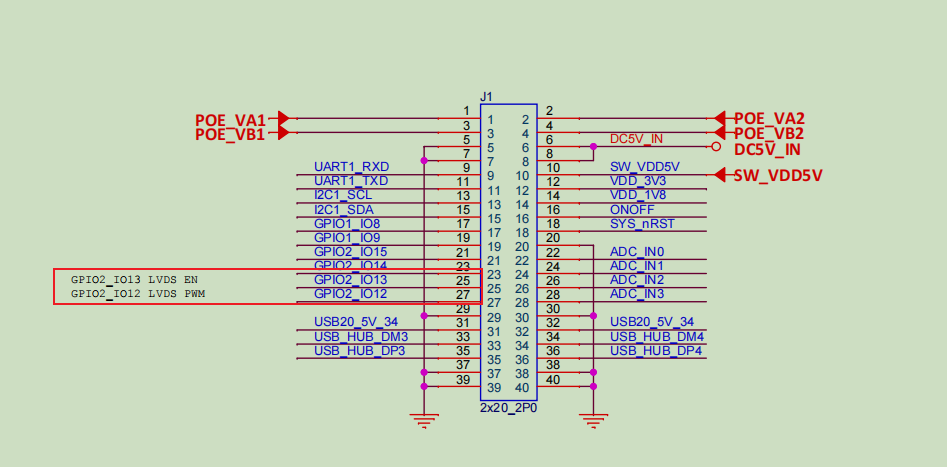

### PWM


This section takes GPIO2_IO13 and GPIO2_IO12 as examples of configuring PWM:





1. Configure the device tree

```
// ADD GPIO2_IO12 as PWM3
&tpm3 {
	status = "okay";
	pinctrl-names = "default";
	pinctrl-0 = <&pinctrl_pwm3>;
};

// ADD GPIO2_IO13 as PWM4
&tpm4 {
	status = "okay";
	pinctrl-names = "default";
	pinctrl-0 = <&pinctrl_pwm4>;
};


pinctrl_pwm3: pwm3grp {
		fsl,pins = <
			MX93_PAD_GPIO_IO12__TPM3_CH2	0x39e
		>;
	};

pinctrl_pwm4: pwm4grp {
		fsl,pins = <
			MX93_PAD_GPIO_IO13__TPM4_CH2	0x39e
		>;
	};
```


2. Configure PWM via sys:

Here, TPM3_CH2 is configured to output a 5 kHz signal with a 50% duty cycle, and TPM4_CH2 outputs a 5 kHz signal with the same duty cycle but inverted polarity:

```
echo 2 > /sys/class/pwm/pwmchip0/export  //Export channel
echo 200000 > /sys/class/pwm/pwmchip0/pwm2/period  //Set period
echo 100000 > /sys/class/pwm/pwmchip0/pwm2/duty_cycle  //Set duty cycle
echo 1 > /sys/class/pwm/pwmchip0/pwm2/enable //Enable output


echo 2 > /sys/class/pwm/pwmchip1/export
echo 200000 > /sys/class/pwm/pwmchip1/pwm2/period
echo 100000 > /sys/class/pwm/pwmchip1/pwm2/duty_cycle
echo inversed > /sys/class/pwm/pwmchip1/pwm2/polarity //Set inverted polarity
echo 1 > /sys/class/pwm/pwmchip1/pwm2/enable

```