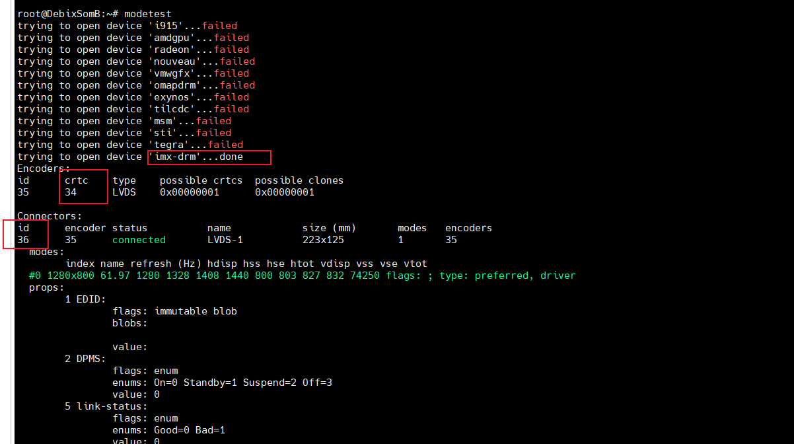
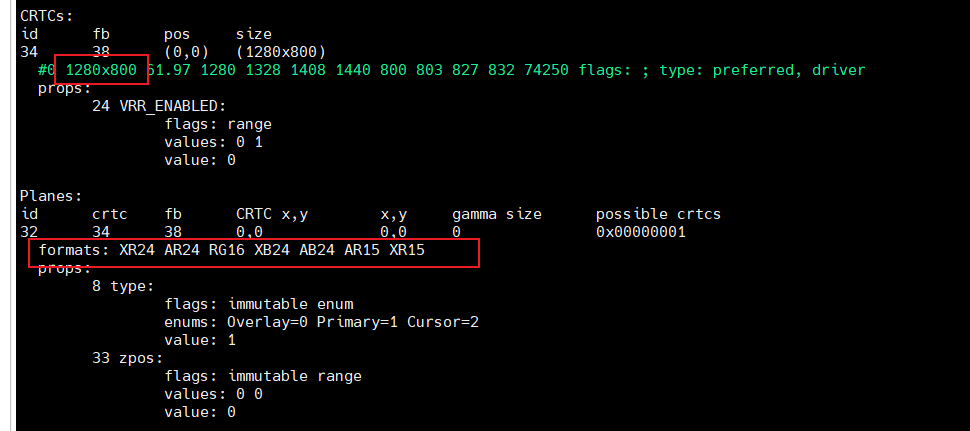

### SOMB+MIPI+TD101A Display


1. Configure Backlight

Here we take TPM5 as an example:

```
	lvds_backlight: lvds_backlight {
		compatible = "pwm-backlight";
		pwms = <&tpm5 0 100000 0>;
		status = "okay";
		//pinctrl-0 = <&pinctrl_pwm_en>;
		enable-gpios = <&pca9535 7 GPIO_ACTIVE_HIGH>;

		brightness-levels = < 0  1  2  3  4  5  6  7  8  9
				     10 11 12 13 14 15 16 17 18 19
				     20 21 22 23 24 25 26 27 28 29
				     30 31 32 33 34 35 36 37 38 39
				     40 41 42 43 44 45 46 47 48 49
				     50 51 52 53 54 55 56 57 58 59
				     60 61 62 63 64 65 66 67 68 69
				     70 71 72 73 74 75 76 77 78 79
				     80 81 82 83 84 85 86 87 88 89
				     90 91 92 93 94 95 96 97 98 99
				    100>;
		default-brightness-level = <80>;
	};

	
&tpm5 {
	pinctrl-names = "default";
	pinctrl-0 = <&pinctrl_pwm5>;
	status = "okay";
};

```


```
&iomuxc {
	pinctrl_pwm5: pwm5grp {
		fsl,pins = <
			MX93_PAD_GPIO_IO06__TPM5_CH0	0x139e
		>;
	};


};

```


2. Configure ldb

```
&ldb_phy {
	status = "okay";
};


&ldb {
	status = "okay";

	lvds-channel@0 {
		//fsl,data-mapping = "jeida";
		fsl,data-mapping = "spwg";
		fsl,data-width = <24>;
		status = "okay";

		port@1 {
			reg = <1>;

			lvds_out: endpoint {
				remote-endpoint = <&panel_lvds_in>;
			};
		};
	};
};

lvds0_panel {
		compatible = "debix,JW101HD_X00";
		//compatible = "boe,ev121wxm-n10-1850";
		pinctrl-names = "default";
		//pinctrl-0 = <&pinctrl_lvds_en>;
		enable-gpios = <&pca9535 8 GPIO_ACTIVE_HIGH>;
		
		backlight = <&lvds_backlight>;
		 rotation = <90>;
		//drm,panel-orientation = <2>;

		port {
			panel_lvds_in: endpoint {
				remote-endpoint = <&lvds_out>;
			};
		};
	};
```


**Disable DSI**<br>
Since the SOM-B only supports one display interface at a time, the MIPI DSI interface must be disabled.

```
&dphy {
	status = "disabled";
};

&dsi {
	status = "disabled";
};
```


3. Configure Clock

```
&lcdif {
	status = "okay";
	assigned-clock-rates = <498000000>, <71142857>, <400000000>, <133333333>;
};
```


4. Debug Methods

Common debugging tools:

```
drmdevice
Modetest - check if the display pipeline (link) is working properly

fbset
cat /sys/kernel/debug/dri/0/state — check current display state

/sys/class/backlight/lvds_backlight/brightness — control backlight


```

Use modetest to display color bars for testing:

```shell
modetest -M imx-drm -s 36@34:1280x800@XR24 # This command sets color-bar test mode.
systemctl stop weston # If Weston is running, disable it first
setting mode 1280x800-61.97Hz on connectors 36, crtc 34
```





