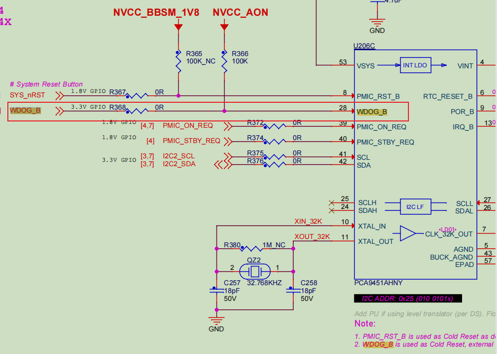

Watchdog:

### 1. Function:

Monitors whether the system has encountered a fault and resets it if necessary.

For example, during an OTA upgrade, if the system fails and the watchdog is not fed in time, it will trigger a reboot. After a certain number of reboots, the system will enter recovery mode.


### 2. Enabling the Watchdog

2.1 Device Tree Configuration

Reference: Documentation/devicetree/bindings/watchdog/fsl-imx7ulp-wdt.yaml

```
&wdog3 {
	timeout-sec = <40>;// Timeout period
	fsl,ext-reset-output;
	status = "okay";

};
```

>  fsl,ext-reset-output:
>
>   description:
>
>    When set, wdog can generate external reset from the wdog_any pin.
>
>   type: boolean

fsl,ext-reset-output is used to describe the WDOG_B pin, which resets the system.




2.2 Driver

Driver path:

```
drivers/watchdog/imx7ulp_wdt.c
```

By default, the watchdog is not enabled when the driver is loaded.<br>
If you want the watchdog to start automatically at boot, add the following code to the driver:

```

diff --git a/drivers/watchdog/imx7ulp_wdt.c b/drivers/watchdog/imx7ulp_wdt.c
index 0f13a3053..f2112a103 100644
--- a/drivers/watchdog/imx7ulp_wdt.c
+++ b/drivers/watchdog/imx7ulp_wdt.c
@@ -351,7 +351,7 @@ static int imx7ulp_wdt_probe(struct platform_device *pdev)
        ret = imx7ulp_wdt_init(imx7ulp_wdt, wdog->timeout * imx7ulp_wdt->hw->wdog_clock_rate);
        if (ret)
                return ret;
-
+       imx7ulp_wdt_start(wdog);// Start the watchdog
        return devm_watchdog_register_device(dev, wdog);
 }

```


After the driver is loaded, you can check the watchdog status with the following command:

```
root@DebixSomB:~# wdctl
Device:        /dev/watchdog0
Identity:      i.MX7ULP watchdog timer [version 0]
Timeout:       40 seconds
Pre-timeout:    0 seconds
FLAG           DESCRIPTION               STATUS BOOT-STATUS
KEEPALIVEPING  Keep alive ping reply          1           0
MAGICCLOSE     Supports magic close char      0           0
SETTIMEOUT     Set timeout (in seconds)       0           0

```

2.3 Feeding the Watchdog

Once the watchdog starts at boot, if it is not fed, the system will reboot after approximately 40 seconds.

You can feed the watchdog by executing:

```
echo > /dev/watchdog0
```


### 3. Test Results


If you do not feed the watchdog, the system will reset after 40 seconds!

If you feed it, the system will not reset!

